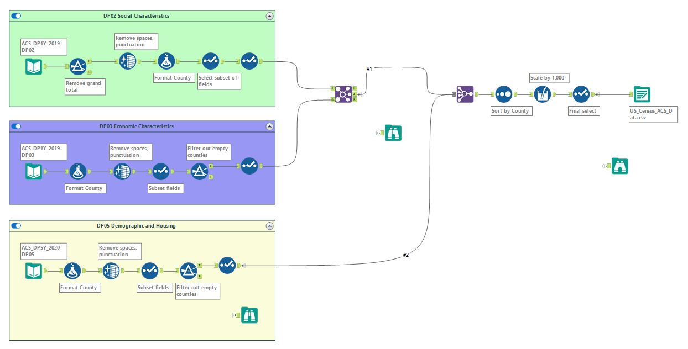

```{r setup, include=FALSE}
knitr::opts_chunk$set(echo = TRUE)
```

```{r echo=FALSE, warning=FALSE, message=FALSE}
library(tidyverse, warn.conflicts = FALSE)
```

```{r echo=FALSE, message=FALSE, warning=FALSE}
library(janitor)
library(skimr)
```

```{r}
library(arules)
```


## Project Overview

Perform Market Basket Analysis on US Census data to extract patterns and associations from demographic data for New York state.


## Research Question

Identify specific patterns and segments of the New York state population for post COVID-19 risk factors such as job loss, stress, anxiety, and depression. The risk factors are:

1 - Unemployed
2 - Household income less than $50,000 dollars per year
3 - Living Alone
4 - No Partner
5 - Living with Disability
6 - No Health Insurance
7 - Divorced
8 - Widowed
9 - Separated
10 - Over 65
11 - Number of African American individuals per County
12 - Number of Hispanic individuals per County


## Data Set

The American Community Survey known as ACS is a part of the US Census Bureau which conducts annual surveys of three million people throughout the United States. The data set consists of the ACS 2019 one-year estimates for social and economic characteristics, and the 2020 5-year estimates for demographic and housing data for New York state.  The ACS estimates are within the 90% confidence interval.


### ACS Data Files

- DP02 Social Characteristics

- DP03 Economic Characteristics

- DP05 Demographic and Housing Characteristics


## Data Preprocessing


### Alteryx Process




An ETL (Extract, Transform, Load) workflow was created using Alteryx Designer. The workflow performs the following tasks for each of the three ACS files:

1 - Download CSV file

2 - Filter records to exclude grand totals

3 - Clean numeric cells by removing spaces, punctuation, and characters

4 - Rename columns


After each CSV file is cleaned, then they are merged into a single CSV file which is used for creating the market basket CSV file. The data values are then scaled to be in thousands (1,000s).


## Read US Census file


```{r}
census <- read.csv('data/US_Census_ACS_Data.csv')
```

```{r}
skim(census)
```

```{r}
population <- census %>% 
  subset(select = c(County, Total.Population, Total.Population.Male, Total.Population.Female)) %>% 
  arrange(desc(Total.Population))
```

```{r}
str(population)
```


## Exploratory Data Analysis


Check for outliers and skewness in the data set which could impact the Market Basket Analysis


```{r}
ggplot(population, aes(x=reorder(County, -Total.Population), y=Total.Population, fill=Total.Population)) +
  geom_col() +
  ggtitle("County Population") +
  geom_hline(yintercept=1000, linetype="solid", color = "red") +
  theme(axis.text.x = element_text(angle=60, hjust=1),
        plot.title = element_text(size=16, face="bold")) +
  labs(x="County", y="Population (in thousands)")
```

The census data is skewed to the right where a few counties have over 1 million residents. Because association analysis does not perform well with skewed data, the data set will be partitioned into two data frames. One data frame will be for NYC counties and the remaining counties with a population less than 1 Million individuals will be in another data frame.

This should also help in avoiding the Simpsons paradox in which association rules for the aggregate of counties differ from when the data is stratified.


## Partition US Census data set into two separate data frames


```{r}
census_nyc <- census %>% 
  filter(County %in% c("Kings", "Queens", "New York", "Suffolk", "Bronx", "Nassau"))
```

```{r}
census_ny_other <- census %>% 
  filter(!County %in% c("Kings", "Queens", "New York", "Suffolk", "Bronx", "Nassau"))
```


### Export data frames to CSV files


```{r}
write_csv(census_nyc, 'data/Census_Nyc.csv')
```

```{r}
write_csv(census_ny_other, 'data/Census_Ny_Other.csv')
```


## Create Market Basket files 

Create two market basket files for NYC and NY Other CSV Census files. A separate R script is executed on each of these files to create the Market Basket files.


## Data Visualizations for NYC and NY Other

### NYC Population


```{r}
population_nyc <- population %>% 
  filter(County %in% c("Kings", "Queens", "New York", "Suffolk", "Bronx", "Nassau")) %>% 
  subset(select = c(County, Total.Population.Male)) %>% 
  mutate(Gender = "Male")
```

```{r}
population_nyc_f <- population %>% 
  filter(County %in% c("Kings", "Queens", "New York", "Suffolk", "Bronx", "Nassau")) %>% 
  subset(select = c(County, Total.Population.Female)) %>% 
  mutate(Gender = "Female")
```


```{r}
colnames(population_nyc) <- c("County", "Population", "Gender")
colnames(population_nyc_f) <- c("County", "Population", "Gender")
```

```{r}
population_nyc <- rbind(population_nyc, population_nyc_f)
```


```{r}
ggplot(population_nyc, aes(x=reorder(County, -Population) , y=Population, fill=Population)) +
  geom_col() +
  ggtitle("New York City Population") +
  theme(axis.text.x = element_text(angle=60, hjust=1),
        plot.title = element_text(size=16, face="bold")) +
  labs(x="County", y="Population (in thousands)") +
  facet_wrap(~Gender)
  
```


### New York Other Population


```{r}
population_ny_other <- population %>% 
  filter(!County %in% c("Kings", "Queens", "New York", "Suffolk", "Bronx", "Nassau")) %>% 
  subset(select = c(County, Total.Population.Male)) %>% 
  mutate(Gender = "Male")
```

```{r}
population_ny_other_f <- population %>% 
  filter(!County %in% c("Kings", "Queens", "New York", "Suffolk", "Bronx", "Nassau")) %>% 
  subset(select = c(County, Total.Population.Female)) %>% 
  mutate(Gender = "Female")
```

```{r}
colnames(population_ny_other) <- c("County", "Population", "Gender")
colnames(population_ny_other_f) <- c("County", "Population", "Gender")
```

```{r}
population_ny_other <- rbind(population_ny_other, population_ny_other_f)
```

```{r }
ggplot(population_ny_other, aes(x=reorder(County, -Population) , y=Population, fill=Population)) +
  geom_col() +
  ggtitle("New York Other Population") +
  theme(axis.text.x = element_text(angle=60, hjust=1),
        plot.title = element_text(size=16, face="bold")) +
  labs(x="County", y="Population (in thousands)") +
  facet_wrap(~Gender, ncol = 1)
```


## Market Basket Analysis

Conduct market basket analysis in which each transaction in the market basket represents an individual. For example, the transaction for  {Bronx, Coahabiting.household} represents a single cohabiting household living in the Bronx county.

The first step is to find frequent itemsets for specific risk factors outlined in the research question which include:

- Unemployed
- Over 65
- Divorced
- Separated
- Living Alone
- African American race
- Hispanic race


### Create Market Basket Transactions

Two separate market baskets will be created, one for Nyc and the other for all other counties outside Nyc


```{r}
nyc_basket <- read.transactions("data/market_basket_nyc.csv")
```

```{r}
inspect(head(nyc_basket, 12))
```


```{r}
inspect(tail(nyc_basket, 12))
```

```{r}
ny_other_basket <- read.transactions('data/market_basket_ny_other.csv')
```

```{r}
inspect(head(ny_other_basket, 10))
```

```{r}
inspect(tail(ny_other_basket, 10))
```


### Apriori Algorithm

#### Find Frequent Itemsets

Find frequent itemsets for both Nyc and Ny-Other baskets containing the risk factors


```{r}

```

```{r}

```


