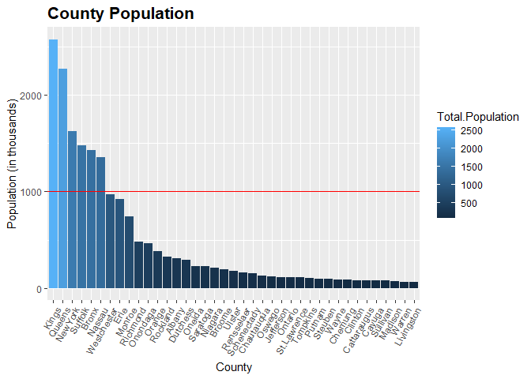
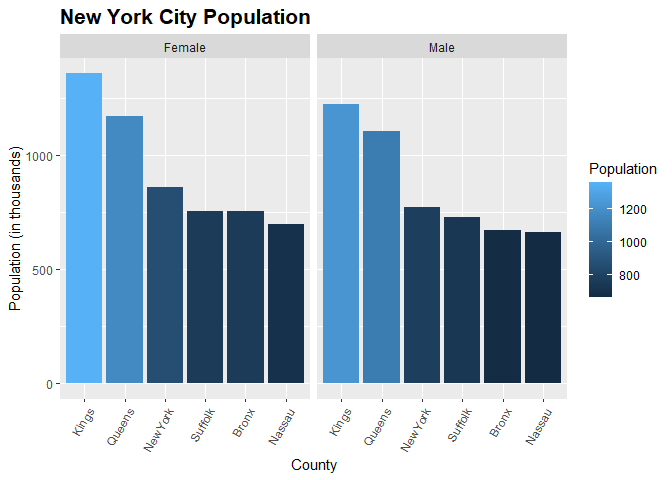
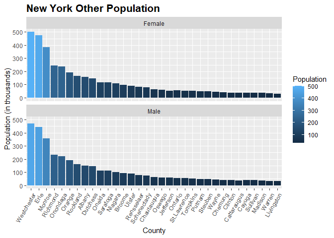
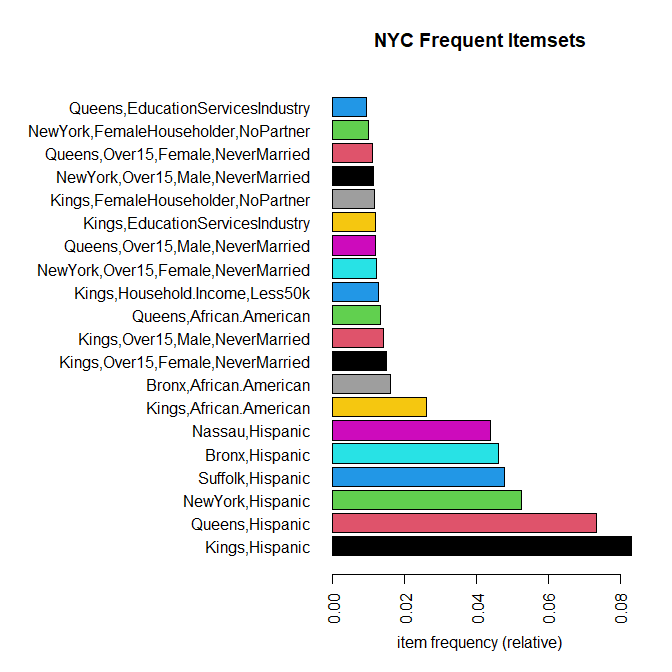
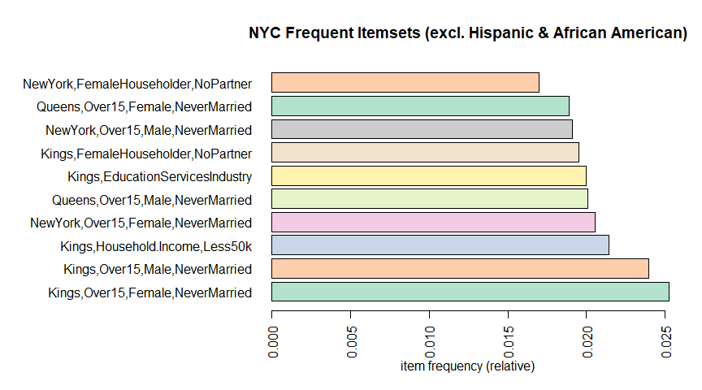
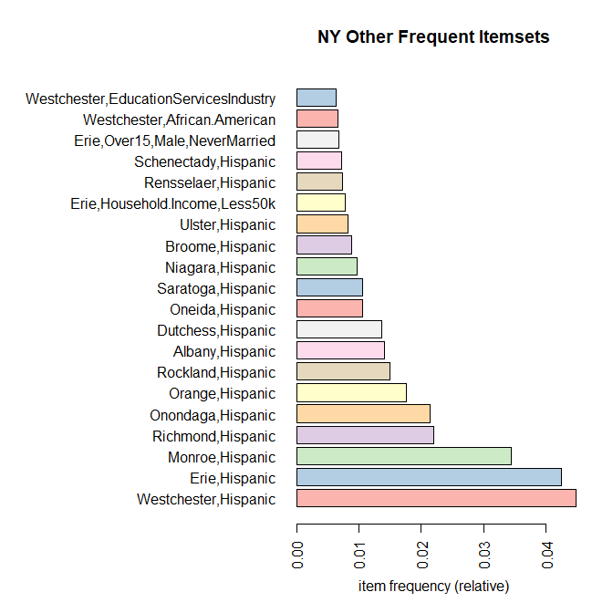
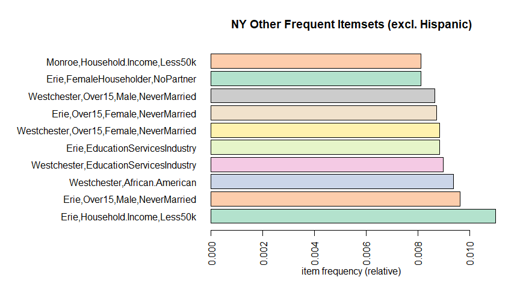

DSC-607 Data Mining: Final Project
================
Michael Albers

``` r
library(arules)
```

    ## Loading required package: Matrix

    ## 
    ## Attaching package: 'Matrix'

    ## The following objects are masked from 'package:tidyr':
    ## 
    ##     expand, pack, unpack

    ## 
    ## Attaching package: 'arules'

    ## The following object is masked from 'package:dplyr':
    ## 
    ##     recode

    ## The following objects are masked from 'package:base':
    ## 
    ##     abbreviate, write

## Project Overview

Perform Market Basket Analysis on US Census data to extract patterns and
associations from demographic data for New York state.

## Research Question

Identify specific patterns and segments of the New York state population
for post COVID-19 risk factors such as job loss, stress, anxiety, and
depression. The risk factors are:

1 - Unemployed

2 - Household income less than $50,000 dollars per year

3 - Living Alone

4 - No Partner

5 - Living with Disability

6 - No Health Insurance

7 - Divorced

8 - Widowed

9 - Separated

10 - Over 65

11 - Number of African American individuals per County

12 - Number of Hispanic individuals per County

## Data Set

The American Community Survey known as ACS is a part of the US Census
Bureau which conducts annual surveys of three million people throughout
the United States. The data set consists of the ACS 2019 one-year
estimates for social and economic characteristics, and the 2020 5-year
estimates for demographic and housing data for New York state. The ACS
estimates are within the 90% confidence interval.

### ACS Data Files

-   DP02 Social Characteristics

-   DP03 Economic Characteristics

-   DP05 Demographic and Housing Characteristics

## Data Preprocessing

### Alteryx Process


An ETL (Extract, Transform, Load) workflow was created using Alteryx
Designer. The workflow performs the following tasks for each of the
three ACS files:

1 - Download CSV file

2 - Filter records to exclude grand totals

3 - Clean numeric cells by removing spaces, punctuation, and characters

4 - Rename columns

After each CSV file is cleaned, then they are merged into a single CSV
file which is used for creating the market basket CSV file. The data
values are then scaled to be in thousands (1,000s).

## Read US Census file

``` r
census <- read.csv('data/US_Census_ACS_Data.csv')
```

``` r
# Remove space character from the county column
census$County <- str_remove(census$County, ' ')
```

``` r
skim(census)
```

|                                                  |        |
|:-------------------------------------------------|:-------|
| Name                                             | census |
| Number of rows                                   | 39     |
| Number of columns                                | 93     |
| \_\_\_\_\_\_\_\_\_\_\_\_\_\_\_\_\_\_\_\_\_\_\_   |        |
| Column type frequency:                           |        |
| character                                        | 1      |
| numeric                                          | 92     |
| \_\_\_\_\_\_\_\_\_\_\_\_\_\_\_\_\_\_\_\_\_\_\_\_ |        |
| Group variables                                  | None   |

Data summary

**Variable type: character**

| skim_variable | n_missing | complete_rate | min | max | empty | n_unique | whitespace |
|:--------------|----------:|--------------:|----:|----:|------:|---------:|-----------:|
| County        |         0 |             1 |   4 |  11 |     0 |       39 |          0 |

**Variable type: numeric**

| skim_variable                               | n_missing | complete_rate |   mean |     sd |  p0 |  p25 |   p50 |    p75 | p100 | hist  |
|:--------------------------------------------|----------:|--------------:|-------:|-------:|----:|-----:|------:|-------:|-----:|:------|
| Cohabiting.household                        |         0 |          1.00 |  11.38 |  13.40 |   2 |  3.0 |   6.0 |  12.00 |   60 | ▇▁▁▁▁ |
| Cohabiting.household_ChildrenUnder18        |         0 |          1.00 |   3.38 |   3.82 |   0 |  1.0 |   2.0 |   4.00 |   16 | ▇▂▁▁▁ |
| MaleHouseholder_NoPartner                   |         0 |          1.00 |  34.03 |  49.11 |   3 |  7.5 |  12.0 |  31.00 |  202 | ▇▁▁▁▁ |
| MaleHouseholder_NoPartner_ChildrenUnder18   |         0 |          1.00 |   1.82 |   2.45 |   0 |  0.0 |   1.0 |   2.50 |   10 | ▇▂▁▁▁ |
| MaleHouseholder_LivingAlone                 |         0 |          1.00 |  23.49 |  32.93 |   3 |  5.0 |   9.0 |  24.00 |  157 | ▇▁▁▁▁ |
| MaleHouseholder_LivingAlone_Over65          |         0 |          1.00 |   6.97 |   8.67 |   1 |  2.0 |   3.0 |   7.50 |   36 | ▇▁▁▁▁ |
| FemaleHouseholder_NoPartner                 |         0 |          1.00 |  57.54 |  86.55 |   6 |  9.0 |  20.0 |  50.00 |  355 | ▇▁▁▁▁ |
| FemaleHouseholder_NoPartner_ChildrenUnder18 |         0 |          1.00 |   9.38 |  14.60 |   1 |  2.0 |   3.0 |   9.00 |   62 | ▇▁▁▁▁ |
| FemaleHouseholder_LivingAlone               |         0 |          1.00 |  31.64 |  46.38 |   3 |  6.0 |  13.0 |  29.00 |  209 | ▇▁▁▁▁ |
| FemaleHouseholder_LivingAlone_Over65        |         0 |          1.00 |  15.79 |  21.21 |   2 |  3.0 |   6.0 |  14.00 |   83 | ▇▁▁▁▁ |
| Households_WithUnder18                      |         0 |          1.00 |  50.69 |  68.02 |   6 | 10.0 |  18.0 |  50.50 |  291 | ▇▁▁▁▁ |
| Households_WithOver65                       |         0 |          1.00 |  58.23 |  75.06 |   8 | 12.0 |  25.0 |  56.50 |  284 | ▇▁▁▁▁ |
| Over15_Male                                 |         0 |          1.00 | 187.69 | 246.00 |  26 | 40.5 |  75.0 | 184.00 |  960 | ▇▁▁▁▁ |
| Over15_Male_NeverMarried                    |         0 |          1.00 |  77.49 | 108.80 |   8 | 15.0 |  30.0 |  71.00 |  435 | ▇▁▁▁▁ |
| Over15_Male_Married                         |         0 |          1.00 |  88.38 | 115.75 |  12 | 19.0 |  34.0 |  90.50 |  446 | ▇▁▁▁▁ |
| Over15_Male_Separated                       |         0 |          1.00 |   3.38 |   4.62 |   0 |  1.0 |   1.0 |   3.00 |   18 | ▇▁▁▁▁ |
| Over15_Male_Widowed                         |         0 |          1.00 |   4.79 |   5.90 |   0 |  1.0 |   2.0 |   5.50 |   23 | ▇▁▁▁▁ |
| Over15_Male_Divorced                        |         0 |          1.00 |  13.54 |  14.91 |   2 |  4.0 |   7.0 |  13.50 |   50 | ▇▁▁▁▁ |
| Over15_Female                               |         0 |          1.00 | 204.10 | 275.54 |  26 | 40.5 |  77.0 | 202.00 | 1106 | ▇▁▁▁▁ |
| Over15_Female_NeverMarried                  |         0 |          1.00 |  73.79 | 111.87 |   7 | 10.5 |  23.0 |  66.50 |  459 | ▇▁▁▁▁ |
| Over15_Female_Married                       |         0 |          1.00 |  86.51 | 111.81 |  11 | 19.5 |  36.0 |  93.50 |  432 | ▇▁▁▁▁ |
| Over15_Female_Separated                     |         0 |          1.00 |   5.31 |   9.07 |   0 |  1.0 |   2.0 |   4.00 |   36 | ▇▁▁▁▁ |
| Over15_Female_Widowed                       |         0 |          1.00 |  17.59 |  22.84 |   2 |  4.0 |   7.0 |  17.50 |   91 | ▇▁▁▁▁ |
| Over15_Female_Divorced                      |         0 |          1.00 |  20.74 |  25.69 |   3 |  5.0 |   9.0 |  20.00 |   96 | ▇▁▁▁▁ |
| Nursery.preschool.enrollment                |         0 |          1.00 |   7.31 |  10.50 |   1 |  1.0 |   2.0 |   7.50 |   47 | ▇▁▁▁▁ |
| Kindergarten.enrollment                     |         0 |          1.00 |   5.44 |   7.96 |   0 |  1.0 |   2.0 |   5.50 |   38 | ▇▁▁▁▁ |
| Elementary.school.enrollment                |         0 |          1.00 |  43.05 |  57.81 |   5 |  9.0 |  15.0 |  44.50 |  249 | ▇▁▁▁▁ |
| High.school.enrollment                      |         0 |          1.00 |  23.10 |  30.14 |   3 |  4.5 |   8.0 |  25.00 |  122 | ▇▁▁▁▁ |
| Under18_With.Disability                     |         0 |          1.00 |   3.51 |   4.36 |   0 |  1.0 |   2.0 |   4.00 |   20 | ▇▁▁▁▁ |
| Age18to64_With.Disability                   |         0 |          1.00 |  25.59 |  29.66 |   4 |  7.0 |  12.0 |  28.00 |  117 | ▇▁▁▁▁ |
| Over65_With.Disability                      |         0 |          1.00 |  24.00 |  31.59 |   3 |  5.5 |  11.0 |  23.00 |  125 | ▇▁▁▁▁ |
| Over16                                      |         0 |          1.00 | 386.49 | 514.77 |  53 | 79.5 | 151.0 | 379.50 | 2037 | ▇▁▁▁▁ |
| Over16_Employed                             |         0 |          1.00 | 234.82 | 318.88 |  31 | 44.0 |  84.0 | 226.00 | 1241 | ▇▁▁▁▁ |
| Over16_Unemployed                           |         0 |          1.00 |  10.92 |  16.26 |   1 |  2.0 |   3.0 |   9.00 |   60 | ▇▁▁▁▁ |
| Over16_ArmedForces                          |         0 |          1.00 |   0.64 |   2.16 |   0 |  0.0 |   0.0 |   0.50 |   13 | ▇▁▁▁▁ |
| Over16_Female                               |         0 |          1.00 | 201.59 | 272.37 |  26 | 40.5 |  77.0 | 199.00 | 1092 | ▇▁▁▁▁ |
| Over16_Female_Employed                      |         0 |          1.00 | 114.85 | 156.67 |  14 | 21.0 |  41.0 | 112.50 |  626 | ▇▁▁▁▁ |
| Householder_ChildrenUnder6                  |         1 |          0.97 |  31.95 |  45.34 |   3 |  6.0 |  10.5 |  31.00 |  204 | ▇▁▁▁▁ |
| Householder_Children6to17                   |         1 |          0.97 |  63.32 |  82.52 |   8 | 13.0 |  22.0 |  68.25 |  349 | ▇▁▁▁▁ |
| BusinessOccupation                          |         0 |          1.00 | 102.18 | 147.42 |  11 | 15.5 |  34.0 |  96.00 |  574 | ▇▁▁▁▁ |
| ServiceOccupation                           |         0 |          1.00 |  47.49 |  70.83 |   5 |  9.0 |  17.0 |  43.00 |  284 | ▇▁▁▁▁ |
| SalesOccupation                             |         0 |          1.00 |  46.36 |  61.13 |   5 |  8.0 |  17.0 |  48.50 |  227 | ▇▁▁▁▁ |
| NaturalResourcesOccupation                  |         0 |          1.00 |  16.36 |  21.70 |   2 |  4.0 |   7.0 |  17.50 |   94 | ▇▁▁▁▁ |
| TransportationOccupation                    |         0 |          1.00 |  22.23 |  29.17 |   2 |  5.5 |  10.0 |  22.00 |  125 | ▇▁▁▁▁ |
| AgricultureIndustry                         |         0 |          1.00 |   1.05 |   0.65 |   0 |  1.0 |   1.0 |   1.00 |    2 | ▂▁▇▁▃ |
| ConstructionIndustry                        |         0 |          1.00 |  13.85 |  19.89 |   1 |  3.0 |   5.0 |  13.50 |   88 | ▇▁▁▁▁ |
| MfgIndustry                                 |         0 |          1.00 |  12.77 |  13.01 |   2 |  4.0 |   8.0 |  15.00 |   50 | ▇▂▁▁▁ |
| WholesaleIndustry                           |         0 |          1.00 |   5.38 |   7.54 |   0 |  1.0 |   2.0 |   6.00 |   26 | ▇▁▁▁▁ |
| RetailIndustry                              |         0 |          1.00 |  22.51 |  28.60 |   3 |  5.0 |  10.0 |  22.00 |  111 | ▇▁▁▁▁ |
| WarehousingIndustry                         |         0 |          1.00 |  13.49 |  21.96 |   1 |  2.0 |   4.0 |  14.00 |   94 | ▇▁▁▁▁ |
| InformationIndustry                         |         0 |          1.00 |   6.90 |  13.81 |   0 |  1.0 |   1.0 |   5.00 |   63 | ▇▁▁▁▁ |
| InsuranceIndustry                           |         0 |          1.00 |  18.85 |  32.26 |   1 |  2.0 |   5.0 |  16.00 |  157 | ▇▁▁▁▁ |
| WasteManagementIndustry                     |         0 |          1.00 |  29.13 |  46.52 |   2 |  3.0 |   8.0 |  24.50 |  187 | ▇▁▁▁▁ |
| EducationServicesIndustry                   |         0 |          1.00 |  67.56 |  88.63 |   9 | 12.0 |  26.0 |  70.50 |  363 | ▇▁▁▁▁ |
| EntertainmentIndustry                       |         0 |          1.00 |  22.08 |  32.99 |   2 |  4.0 |   7.0 |  17.50 |  132 | ▇▁▁▁▁ |
| OtherServicesIndustry                       |         0 |          1.00 |  10.49 |  15.51 |   1 |  2.0 |   4.0 |   9.50 |   70 | ▇▁▁▁▁ |
| PublicAdminIndustry                         |         0 |          1.00 |  10.64 |  12.19 |   1 |  2.5 |   5.0 |  14.00 |   46 | ▇▁▂▁▁ |
| Household.Income_Less10k                    |         0 |          1.00 |  12.18 |  20.06 |   1 |  2.0 |   4.0 |  10.00 |   77 | ▇▁▁▁▁ |
| Household.Income_10to15k                    |         0 |          1.00 |   7.95 |  12.20 |   0 |  2.0 |   3.0 |   7.50 |   55 | ▇▁▁▁▁ |
| Household.Income_15to25k                    |         0 |          1.00 |  13.82 |  18.69 |   1 |  3.0 |   6.0 |  12.50 |   85 | ▇▁▁▁▁ |
| Household.Income_25to35k                    |         0 |          1.00 |  12.92 |  17.18 |   2 |  4.0 |   6.0 |  12.00 |   75 | ▇▁▁▁▁ |
| Household.Income_35to50k                    |         0 |          1.00 |  17.97 |  22.44 |   2 |  5.0 |   8.0 |  20.50 |   97 | ▇▂▁▁▁ |
| Household.Foodstamp.benefits                |         0 |          1.00 |  25.67 |  45.02 |   1 |  5.0 |   8.0 |  19.00 |  204 | ▇▁▁▁▁ |
| Age19to64_Employed                          |         0 |          1.00 | 216.15 | 297.54 |  28 | 40.5 |  76.0 | 208.50 | 1174 | ▇▁▁▁▁ |
| Age19to64_Employed_NoHealthInsurance        |         0 |          1.00 |  15.64 |  29.03 |   1 |  2.0 |   4.0 |  10.50 |  138 | ▇▁▁▁▁ |
| Age19to64_Unemployed                        |         0 |          1.00 |   9.62 |  14.91 |   0 |  2.0 |   3.0 |   8.00 |   55 | ▇▁▁▁▁ |
| Age19to64_Unemployed_NoHealthInsurance      |         0 |          1.00 |   1.33 |   2.44 |   0 |  0.0 |   0.0 |   1.50 |   10 | ▇▁▁▁▁ |
| Total.Population                            |         0 |          1.00 | 474.92 | 635.48 |  63 | 97.5 | 178.0 | 469.00 | 2577 | ▇▁▁▁▁ |
| Total.Population.Male                       |         0 |          1.00 | 230.10 | 304.05 |  32 | 48.5 |  89.0 | 227.00 | 1221 | ▇▁▁▁▁ |
| Total.Population.Female                     |         0 |          1.00 | 244.97 | 331.58 |  31 | 49.0 |  90.0 | 242.00 | 1356 | ▇▁▁▁▁ |
| Under5                                      |         0 |          1.00 |  27.92 |  41.08 |   3 |  5.0 |   9.0 |  26.50 |  188 | ▇▁▁▁▁ |
| Age5to9                                     |         0 |          1.00 |  26.62 |  36.22 |   3 |  5.0 |   9.0 |  27.50 |  159 | ▇▁▁▁▁ |
| Age10to14                                   |         0 |          1.00 |  28.00 |  37.20 |   3 |  6.0 |   9.0 |  29.00 |  155 | ▇▁▁▁▁ |
| Age15to19                                   |         0 |          1.00 |  28.97 |  34.82 |   3 |  6.0 |  12.0 |  31.00 |  137 | ▇▁▁▁▁ |
| Age20to24                                   |         0 |          1.00 |  31.49 |  39.70 |   3 |  6.5 |  12.0 |  31.50 |  159 | ▇▁▁▁▁ |
| Age25to34                                   |         0 |          1.00 |  70.49 | 110.37 |   7 | 11.0 |  22.0 |  63.00 |  473 | ▇▁▁▁▁ |
| Age35to44                                   |         0 |          1.00 |  59.46 |  86.12 |   7 | 11.0 |  20.0 |  55.50 |  359 | ▇▁▁▁▁ |
| Age45to54                                   |         0 |          1.00 |  62.03 |  81.71 |   8 | 12.5 |  22.0 |  62.50 |  306 | ▇▁▁▁▁ |
| Age55to59                                   |         0 |          1.00 |  32.54 |  41.22 |   5 |  7.0 |  14.0 |  32.50 |  158 | ▇▁▁▁▁ |
| Age60to64                                   |         0 |          1.00 |  29.97 |  37.15 |   5 |  6.5 |  13.0 |  33.00 |  141 | ▇▁▁▁▁ |
| Under18                                     |         0 |          1.00 |  99.56 | 135.60 |  11 | 19.5 |  34.0 | 101.00 |  588 | ▇▁▁▁▁ |
| Over18                                      |         0 |          1.00 | 375.49 | 502.10 |  52 | 77.0 | 147.0 | 367.50 | 1988 | ▇▁▁▁▁ |
| Over65                                      |         0 |          1.00 |  77.56 |  97.69 |  11 | 16.5 |  35.0 |  78.00 |  361 | ▇▁▁▁▁ |
| Over18_Male                                 |         0 |          1.00 | 179.18 | 236.03 |  25 | 38.0 |  73.0 | 174.50 |  920 | ▇▁▁▁▁ |
| Over18_Female                               |         0 |          1.00 | 196.23 | 266.28 |  26 | 39.0 |  74.0 | 192.50 | 1068 | ▇▁▁▁▁ |
| Over65_Male                                 |         0 |          1.00 |  33.23 |  40.67 |   5 |  7.5 |  16.0 |  33.50 |  152 | ▇▁▁▁▁ |
| Over65_Female                               |         0 |          1.00 |  44.33 |  56.99 |   6 |  9.0 |  19.0 |  44.50 |  213 | ▇▁▁▁▁ |
| White                                       |         0 |          1.00 | 288.36 | 310.23 |  58 | 83.5 | 146.0 | 323.50 | 1162 | ▇▁▁▁▁ |
| African.American                            |         0 |          1.00 |  76.28 | 161.50 |   1 |  3.0 |  10.0 |  50.00 |  807 | ▇▁▁▁▁ |
| Native.American                             |         0 |          1.00 |   1.67 |   2.88 |   0 |  0.0 |   0.0 |   2.00 |   11 | ▇▁▁▁▁ |
| Asian                                       |         0 |          1.00 |  42.72 | 108.23 |   0 |  1.0 |   7.0 |  24.00 |  589 | ▇▁▁▁▁ |
| Hispanic                                    |         0 |          1.00 | 474.92 | 635.48 |  63 | 97.5 | 178.0 | 469.00 | 2577 | ▇▁▁▁▁ |

``` r
population <- census %>% 
  subset(select = c(County, Total.Population, Total.Population.Male, Total.Population.Female)) %>% 
  arrange(desc(Total.Population))
```

``` r
str(population)
```

    ## 'data.frame':    39 obs. of  4 variables:
    ##  $ County                 : chr  "Kings" "Queens" "NewYork" "Suffolk" ...
    ##  $ Total.Population       : int  2577 2271 1629 1481 1427 1356 969 919 743 476 ...
    ##  $ Total.Population.Male  : int  1221 1102 772 729 672 661 469 445 358 231 ...
    ##  $ Total.Population.Female: int  1356 1169 858 753 755 695 500 474 385 245 ...

## Exploratory Data Analysis

Check for outliers and skewness in the data set which could impact the
Market Basket Analysis

``` r
ggplot(population, aes(x=reorder(County, -Total.Population), y=Total.Population, fill=Total.Population)) +
  geom_col() +
  ggtitle("County Population") +
  geom_hline(yintercept=1000, linetype="solid", color = "red") +
  theme(axis.text.x = element_text(angle=60, hjust=1),
        plot.title = element_text(size=16, face="bold")) +
  labs(x="County", y="Population (in thousands)")
```

<!-- -->

The census data is skewed to the right where a few counties have over 1
million residents. Because association analysis does not perform well
with skewed data, the data set will be partitioned into two data frames.
One data frame will be for NYC counties and the remaining counties with
a population less than 1 Million individuals will be in another data
frame.

## Partition US Census data set into two separate data frames

``` r
census_nyc <- census %>% 
  filter(County %in% c("Kings", "Queens", "NewYork", "Suffolk", "Bronx", "Nassau"))
```

``` r
census_ny_other <- census %>% 
  filter(!County %in% c("Kings", "Queens", "NewYork", "Suffolk", "Bronx", "Nassau"))
```

### Export data frames to CSV files

``` r
write_csv(census_nyc, 'data/Census_Nyc.csv')
```

``` r
write_csv(census_ny_other, 'data/Census_Ny_Other.csv')
```

## Create Market Basket files

Create two market basket files for NYC and NY Other CSV Census files.
Call **create-market-basket-transactions.R** to create the Market Basket
files.

## Data Visualizations for NYC and NY Other

### NYC Population

``` r
population_nyc <- population %>% 
  filter(County %in% c("Kings", "Queens", "NewYork", "Suffolk", "Bronx", "Nassau")) %>% 
  subset(select = c(County, Total.Population.Male)) %>% 
  mutate(Gender = "Male")
```

``` r
population_nyc_f <- population %>% 
  filter(County %in% c("Kings", "Queens", "NewYork", "Suffolk", "Bronx", "Nassau")) %>% 
  subset(select = c(County, Total.Population.Female)) %>% 
  mutate(Gender = "Female")
```

``` r
colnames(population_nyc) <- c("County", "Population", "Gender")
colnames(population_nyc_f) <- c("County", "Population", "Gender")
```

``` r
population_nyc <- rbind(population_nyc, population_nyc_f)
```

``` r
ggplot(population_nyc, aes(x=reorder(County, -Population) , y=Population, fill=Population)) +
  geom_col() +
  ggtitle("New York City Population") +
  theme(axis.text.x = element_text(angle=60, hjust=1),
        plot.title = element_text(size=16, face="bold")) +
  labs(x="County", y="Population (in thousands)") +
  facet_wrap(~Gender)
```

<!-- -->

### New York Other Population

``` r
population_ny_other <- population %>% 
  filter(!County %in% c("Kings", "Queens", "NewYork", "Suffolk", "Bronx", "Nassau")) %>% 
  subset(select = c(County, Total.Population.Male)) %>% 
  mutate(Gender = "Male")
```

``` r
population_ny_other_f <- population %>% 
  filter(!County %in% c("Kings", "Queens", "NewYork", "Suffolk", "Bronx", "Nassau")) %>% 
  subset(select = c(County, Total.Population.Female)) %>% 
  mutate(Gender = "Female")
```

``` r
colnames(population_ny_other) <- c("County", "Population", "Gender")
colnames(population_ny_other_f) <- c("County", "Population", "Gender")
```

``` r
population_ny_other <- rbind(population_ny_other, population_ny_other_f)
```

``` r
ggplot(population_ny_other, aes(x=reorder(County, -Population) , y=Population, fill=Population)) +
  geom_col() +
  ggtitle("New York Other Population") +
  theme(axis.text.x = element_text(angle=60, hjust=1),
        plot.title = element_text(size=16, face="bold")) +
  labs(x="County", y="Population (in thousands)") +
  facet_wrap(~Gender, ncol = 1)
```

<!-- -->

## Market Basket Analysis

Conduct market basket analysis in which each transaction in the market
basket represents an individual. For example, the transaction for
{Suffolk,Household.Income,Less50k} represents a household earning less
than $50,000 dollars per year in Suffolk county.

The first step is to find frequent itemsets for specific risk factors
outlined in the research question. Then association rules will be
created from transactions with the highest support.

### Create Market Basket Transactions

Two separate market baskets will be created, one for Nyc and the other
for all other counties outside Nyc. The R Script that creates the market
basket CSV files is create-market-basket-transactions.R

``` r
nyc_basket <- read.transactions("data/market_basket_nyc.csv")
```

``` r
inspect(head(nyc_basket, 12))
```

    ##      items                                       
    ## [1]  {Bronx,Cohabiting.household,ChildrenUnder18}
    ## [2]  {Bronx,Cohabiting.household,ChildrenUnder18}
    ## [3]  {Bronx,Cohabiting.household,ChildrenUnder18}
    ## [4]  {Bronx,Cohabiting.household,ChildrenUnder18}
    ## [5]  {Bronx,Cohabiting.household,ChildrenUnder18}
    ## [6]  {Bronx,Cohabiting.household,ChildrenUnder18}
    ## [7]  {Bronx,Cohabiting.household,ChildrenUnder18}
    ## [8]  {Bronx,Cohabiting.household,ChildrenUnder18}
    ## [9]  {Bronx,Cohabiting.household,ChildrenUnder18}
    ## [10] {Bronx,Cohabiting.household,ChildrenUnder18}
    ## [11] {Bronx,Cohabiting.household,ChildrenUnder18}
    ## [12] {Bronx,Cohabiting.household,ChildrenUnder18}

``` r
inspect(tail(nyc_basket, 12))
```

    ##      items                             
    ## [1]  {Suffolk,Household.Income,Less50k}
    ## [2]  {Suffolk,Household.Income,Less50k}
    ## [3]  {Suffolk,Household.Income,Less50k}
    ## [4]  {Suffolk,Household.Income,Less50k}
    ## [5]  {Suffolk,Household.Income,Less50k}
    ## [6]  {Suffolk,Household.Income,Less50k}
    ## [7]  {Suffolk,Household.Income,Less50k}
    ## [8]  {Suffolk,Household.Income,Less50k}
    ## [9]  {Suffolk,Household.Income,Less50k}
    ## [10] {Suffolk,Household.Income,Less50k}
    ## [11] {Suffolk,Household.Income,Less50k}
    ## [12] {Suffolk,Household.Income,Less50k}

``` r
ny_other_basket <- read.transactions('data/market_basket_ny_other.csv')
```

``` r
inspect(head(ny_other_basket, 12))
```

    ##      items                                             
    ## [1]  {Albany,Cohabiting.household,ChildrenUnder18}     
    ## [2]  {Albany,Cohabiting.household,ChildrenUnder18}     
    ## [3]  {Albany,Cohabiting.household,ChildrenUnder18}     
    ## [4]  {Albany,Cohabiting.household,ChildrenUnder18}     
    ## [5]  {Broome,Cohabiting.household,ChildrenUnder18}     
    ## [6]  {Broome,Cohabiting.household,ChildrenUnder18}     
    ## [7]  {Cattaraugus,Cohabiting.household,ChildrenUnder18}
    ## [8]  {Cayuga,Cohabiting.household,ChildrenUnder18}     
    ## [9]  {Cayuga,Cohabiting.household,ChildrenUnder18}     
    ## [10] {Chautauqua,Cohabiting.household,ChildrenUnder18} 
    ## [11] {Chautauqua,Cohabiting.household,ChildrenUnder18} 
    ## [12] {Chemung,Cohabiting.household,ChildrenUnder18}

``` r
inspect(tail(ny_other_basket, 12))
```

    ##      items                                 
    ## [1]  {Westchester,Household.Income,Less50k}
    ## [2]  {Westchester,Household.Income,Less50k}
    ## [3]  {Westchester,Household.Income,Less50k}
    ## [4]  {Westchester,Household.Income,Less50k}
    ## [5]  {Westchester,Household.Income,Less50k}
    ## [6]  {Westchester,Household.Income,Less50k}
    ## [7]  {Westchester,Household.Income,Less50k}
    ## [8]  {Westchester,Household.Income,Less50k}
    ## [9]  {Westchester,Household.Income,Less50k}
    ## [10] {Westchester,Household.Income,Less50k}
    ## [11] {Westchester,Household.Income,Less50k}
    ## [12] {Westchester,Household.Income,Less50k}

### Apriori Algorithm

Discover itemsets for both NYC and NY-Other market baskets for risk
factors:

-   Unemployed
-   NoHealthInsurance
-   African.American
-   Hispanic
-   Less50k
-   Household.Foodstamp.benefits
-   NoPartner
-   Divorced
-   Widowed
-   Separated
-   LivingAlone
-   With.Disability
-   Over65

#### NYC Frequent Itemsets

``` r
nyc_support <- apriori(nyc_basket, 
        parameter = list(target = "frequent", support = 0.0003))
```

    ## Apriori
    ## 
    ## Parameter specification:
    ##  confidence minval smax arem  aval originalSupport maxtime support minlen
    ##          NA    0.1    1 none FALSE            TRUE       5   3e-04      1
    ##  maxlen            target  ext
    ##      10 frequent itemsets TRUE
    ## 
    ## Algorithmic control:
    ##  filter tree heap memopt load sort verbose
    ##     0.1 TRUE TRUE  FALSE TRUE    2    TRUE
    ## 
    ## Absolute minimum support count: 9 
    ## 
    ## set item appearances ...[0 item(s)] done [0.00s].
    ## set transactions ...[210 item(s), 30977 transaction(s)] done [0.00s].
    ## sorting and recoding items ... [193 item(s)] done [0.00s].
    ## creating transaction tree ... done [0.00s].
    ## checking subsets of size 1 done [0.00s].
    ## sorting transactions ... done [0.00s].
    ## writing ... [193 set(s)] done [0.00s].
    ## creating S4 object  ... done [0.00s].

``` r
summary(nyc_support)
```

    ## set of 193 itemsets
    ## 
    ## most frequent items:
    ##                     Bronx,African.American 
    ##                                          1 
    ##            Bronx,Age18to64,With.Disability 
    ##                                          1 
    ## Bronx,Age19to64,Employed,NoHealthInsurance 
    ##                                          1 
    ##                 Bronx,Age19to64,Unemployed 
    ##                                          1 
    ## Bronx,Cohabiting.household,ChildrenUnder18 
    ##                                          1 
    ##                                    (Other) 
    ##                                        188 
    ## 
    ## element (itemset/transaction) length distribution:sizes
    ##   1 
    ## 193 
    ## 
    ##    Min. 1st Qu.  Median    Mean 3rd Qu.    Max. 
    ##       1       1       1       1       1       1 
    ## 
    ## summary of quality measures:
    ##     support              count     
    ##  Min.   :0.0003228   Min.   :  10  
    ##  1st Qu.:0.0011622   1st Qu.:  36  
    ##  Median :0.0022597   Median :  70  
    ##  Mean   :0.0051641   Mean   : 160  
    ##  3rd Qu.:0.0047777   3rd Qu.: 148  
    ##  Max.   :0.0831907   Max.   :2577  
    ## 
    ## includes transaction ID lists: FALSE 
    ## 
    ## mining info:
    ##        data ntransactions support confidence
    ##  nyc_basket         30977   3e-04          1
    ##                                                                                call
    ##  apriori(data = nyc_basket, parameter = list(target = "frequent", support = 3e-04))

``` r
itemFrequencyPlot(nyc_basket,
                    main = "NYC Frequent Itemsets",
                    topN = 20,
                    col = palette("Pastel 2"),
                    type = "relative",
                    horiz = TRUE)
```

<!-- -->

``` r
nyc_basket.plot2 <- nyc_basket[!nyc_basket %in% c("NewYork,Hispanic", "Kings,Hispanic", "Queens,Hispanic", "Suffolk,Hispanic", "Bronx,Hispanic", "Nassau,Hispanic", "Kings,African.American", "Bronx,African.American", "Queens,African.American", "NewYork,African.American", "Suffolk,African.American")]
```

``` r
itemFrequencyPlot(nyc_basket.plot2,
                    main = "NYC Frequent Itemsets (excl. Hispanic & African American)",
                    topN = 10,
                    col = palette("Pastel 1"),
                    type = "relative",
                    horiz = TRUE)
```

<!-- -->

#### NYC Infrequent Itemsets

``` r
inspect(sort(nyc_support, by='support', decreasing = FALSE)[1:10])
```

    ##      items                                             support      count
    ## [1]  {Bronx,Over15,Male,Widowed}                       0.0003228202 10   
    ## [2]  {Queens,Age19to64,Unemployed,NoHealthInsurance}   0.0003228202 10   
    ## [3]  {Nassau,Over15,Female,Separated}                  0.0003228202 10   
    ## [4]  {Queens,Under18,With.Disability}                  0.0003228202 10   
    ## [5]  {Kings,MaleHouseholder,NoPartner,ChildrenUnder18} 0.0003228202 10   
    ## [6]  {NewYork,Over15,Male,Separated}                   0.0003551022 11   
    ## [7]  {Queens,Cohabiting.household,ChildrenUnder18}     0.0003551022 11   
    ## [8]  {Suffolk,Over15,Female,Separated}                 0.0003551022 11   
    ## [9]  {NewYork,Under18,With.Disability}                 0.0003551022 11   
    ## [10] {Kings,Under18,With.Disability}                   0.0004196662 13

#### NY Other - Frequent Itemsets

``` r
ny_other_support <- apriori(ny_other_basket, 
        parameter = list(target = "frequent", support = 0.0003))
```

    ## Apriori
    ## 
    ## Parameter specification:
    ##  confidence minval smax arem  aval originalSupport maxtime support minlen
    ##          NA    0.1    1 none FALSE            TRUE       5   3e-04      1
    ##  maxlen            target  ext
    ##      10 frequent itemsets TRUE
    ## 
    ## Algorithmic control:
    ##  filter tree heap memopt load sort verbose
    ##     0.1 TRUE TRUE  FALSE TRUE    2    TRUE
    ## 
    ## Absolute minimum support count: 6 
    ## 
    ## set item appearances ...[0 item(s)] done [0.00s].
    ## set transactions ...[1107 item(s), 21605 transaction(s)] done [0.00s].
    ## sorting and recoding items ... [555 item(s)] done [0.00s].
    ## creating transaction tree ... done [0.00s].
    ## checking subsets of size 1 done [0.00s].
    ## sorting transactions ... done [0.00s].
    ## writing ... [555 set(s)] done [0.00s].
    ## creating S4 object  ... done [0.00s].

``` r
inspect(sort(ny_other_support, by="support", decreasing = TRUE))
```

    ##       items                                                          support count
    ## [1]   {Westchester,Hispanic}                                    0.0448507290   969
    ## [2]   {Erie,Hispanic}                                           0.0425364499   919
    ## [3]   {Monroe,Hispanic}                                         0.0343901875   743
    ## [4]   {Richmond,Hispanic}                                       0.0220319371   476
    ## [5]   {Onondaga,Hispanic}                                       0.0213839389   462
    ## [6]   {Orange,Hispanic}                                         0.0176810923   382
    ## [7]   {Rockland,Hispanic}                                       0.0150428142   325
    ## [8]   {Albany,Hispanic}                                         0.0141633881   306
    ## [9]   {Dutchess,Hispanic}                                       0.0136079611   294
    ## [10]  {Oneida,Hispanic}                                         0.0105993983   229
    ## [11]  {Saratoga,Hispanic}                                       0.0105993983   229
    ## [12]  {Niagara,Hispanic}                                        0.0097199722   210
    ## [13]  {Broome,Hispanic}                                         0.0088868318   192
    ## [14]  {Ulster,Hispanic}                                         0.0082388336   178
    ## [15]  {Erie,Household.Income,Less50k}                           0.0077759778   168
    ## [16]  {Rensselaer,Hispanic}                                     0.0073594075   159
    ## [17]  {Schenectady,Hispanic}                                    0.0071742652   155
    ## [18]  {Erie,Over15,Male,NeverMarried}                           0.0068039806   147
    ## [19]  {Westchester,African.American}                            0.0066188382   143
    ## [20]  {Westchester,EducationServicesIndustry}                   0.0063411247   137
    ## [21]  {Westchester,Over15,Female,NeverMarried}                  0.0062485536   135
    ## [22]  {Erie,EducationServicesIndustry}                          0.0062485536   135
    ## [23]  {Erie,Over15,Female,NeverMarried}                         0.0061559824   133
    ## [24]  {Westchester,Over15,Male,NeverMarried}                    0.0061096968   132
    ## [25]  {Chautauqua,Hispanic}                                     0.0059245545   128
    ## [26]  {Erie,FemaleHouseholder,NoPartner}                        0.0057394122   124
    ## [27]  {Monroe,Household.Income,Less50k}                         0.0057394122   124
    ## [28]  {Erie,African.American}                                   0.0056005554   121
    ## [29]  {Monroe,Over15,Male,NeverMarried}                         0.0055542698   120
    ## [30]  {Monroe,EducationServicesIndustry}                        0.0055079843   119
    ## [31]  {Oswego,Hispanic}                                         0.0054616987   118
    ## [32]  {Monroe,Over15,Female,NeverMarried}                       0.0053228419   115
    ## [33]  {Monroe,African.American}                                 0.0051839852   112
    ## [34]  {Jefferson,Hispanic}                                      0.0051376996   111
    ## [35]  {Ontario,Hispanic}                                        0.0050914140   110
    ## [36]  {St.Lawrence,Hispanic}                                    0.0049988429   108
    ## [37]  {Westchester,FemaleHouseholder,NoPartner}                 0.0048137005   104
    ## [38]  {Tompkins,Hispanic}                                       0.0047211294   102
    ## [39]  {Putnam,Hispanic}                                         0.0045822726    99
    ## [40]  {Westchester,Over65,Female}                               0.0044434159    96
    ## [41]  {Steuben,Hispanic}                                        0.0044434159    96
    ## [42]  {Monroe,FemaleHouseholder,NoPartner}                      0.0043971303    95
    ## [43]  {Erie,Over65,Female}                                      0.0043508447    94
    ## [44]  {Westchester,Household.Income,Less50k}                    0.0043508447    94
    ## [45]  {Wayne,Hispanic}                                          0.0041657024    90
    ## [46]  {Chemung,Hispanic}                                        0.0038879889    84
    ## [47]  {Erie,MaleHouseholder,NoPartner}                          0.0037491321    81
    ## [48]  {Clinton,Hispanic}                                        0.0037028466    80
    ## [49]  {Cayuga,Hispanic}                                         0.0035639898    77
    ## [50]  {Cattaraugus,Hispanic}                                    0.0035639898    77
    ## [51]  {Onondaga,Household.Income,Less50k}                       0.0034714187    75
    ## [52]  {Erie,FemaleHouseholder,LivingAlone}                      0.0034714187    75
    ## [53]  {Sullivan,Hispanic}                                       0.0034714187    75
    ## [54]  {Onondaga,Over15,Male,NeverMarried}                       0.0034251331    74
    ## [55]  {Monroe,Over65,Female}                                    0.0033788475    73
    ## [56]  {Erie,Over65,Male}                                        0.0032862763    71
    ## [57]  {Madison,Hispanic}                                        0.0032862763    71
    ## [58]  {Onondaga,Over15,Female,NeverMarried}                     0.0032862763    71
    ## [59]  {Onondaga,EducationServicesIndustry}                      0.0032862763    71
    ## [60]  {Richmond,EducationServicesIndustry}                      0.0032399907    70
    ## [61]  {Westchester,Over65,Male}                                 0.0032399907    70
    ## [62]  {Richmond,Over15,Male,NeverMarried}                       0.0031474196    68
    ## [63]  {Warren,Hispanic}                                         0.0029622773    64
    ## [64]  {Livingston,Hispanic}                                     0.0029159917    63
    ## [65]  {Richmond,Over15,Female,NeverMarried}                     0.0028697061    62
    ## [66]  {Monroe,MaleHouseholder,NoPartner}                        0.0028697061    62
    ## [67]  {Westchester,FemaleHouseholder,LivingAlone}               0.0027771349    60
    ## [68]  {Erie,Age18to64,With.Disability}                          0.0027771349    60
    ## [69]  {Erie,MaleHouseholder,LivingAlone}                        0.0027771349    60
    ## [70]  {Monroe,Age18to64,With.Disability}                        0.0026845638    58
    ## [71]  {Erie,Household.Foodstamp.benefits}                       0.0026845638    58
    ## [72]  {Orange,Over15,Male,NeverMarried}                         0.0026382782    57
    ## [73]  {Monroe,FemaleHouseholder,LivingAlone}                    0.0026382782    57
    ## [74]  {Westchester,High.school.enrollment}                      0.0025919926    56
    ## [75]  {Onondaga,FemaleHouseholder,NoPartner}                    0.0025919926    56
    ## [76]  {Monroe,Over65,Male}                                      0.0025919926    56
    ## [77]  {Orange,EducationServicesIndustry}                        0.0024994214    54
    ## [78]  {Rockland,EducationServicesIndustry}                      0.0024531358    53
    ## [79]  {Albany,Over15,Male,NeverMarried}                         0.0024531358    53
    ## [80]  {Erie,RetailIndustry}                                     0.0024068503    52
    ## [81]  {Onondaga,African.American}                               0.0023605647    51
    ## [82]  {Erie,Over15,Female,Divorced}                             0.0023142791    50
    ## [83]  {Albany,Over15,Female,NeverMarried}                       0.0023142791    50
    ## [84]  {Erie,Over65,With.Disability}                             0.0023142791    50
    ## [85]  {Westchester,MaleHouseholder,NoPartner}                   0.0023142791    50
    ## [86]  {Richmond,African.American}                               0.0022679935    49
    ## [87]  {Orange,Over15,Female,NeverMarried}                       0.0022679935    49
    ## [88]  {Richmond,Household.Income,Less50k}                       0.0022217079    48
    ## [89]  {Albany,Household.Income,Less50k}                         0.0021754224    47
    ## [90]  {Monroe,MaleHouseholder,LivingAlone}                      0.0021754224    47
    ## [91]  {Dutchess,Over15,Male,NeverMarried}                       0.0021291368    46
    ## [92]  {Onondaga,Over65,Female}                                  0.0020828512    45
    ## [93]  {Monroe,Household.Foodstamp.benefits}                     0.0020828512    45
    ## [94]  {Dutchess,EducationServicesIndustry}                      0.0020828512    45
    ## [95]  {Richmond,FemaleHouseholder,NoPartner}                    0.0020365656    44
    ## [96]  {Richmond,Over65,Female}                                  0.0020365656    44
    ## [97]  {Erie,High.school.enrollment}                             0.0020365656    44
    ## [98]  {Westchester,RetailIndustry}                              0.0019902800    43
    ## [99]  {Westchester,Over65,With.Disability}                      0.0019902800    43
    ## [100] {Albany,EducationServicesIndustry}                        0.0019439944    42
    ## [101] {Orange,African.American}                                 0.0019439944    42
    ## [102] {Rockland,Over15,Male,NeverMarried}                       0.0019439944    42
    ## [103] {Niagara,Household.Income,Less50k}                        0.0018977089    41
    ## [104] {Westchester,Age18to64,With.Disability}                   0.0018514233    40
    ## [105] {Erie,Over15,Female,Widowed}                              0.0018514233    40
    ## [106] {Albany,FemaleHouseholder,NoPartner}                      0.0018514233    40
    ## [107] {Orange,Household.Income,Less50k}                         0.0018514233    40
    ## [108] {Dutchess,Over15,Female,NeverMarried}                     0.0018051377    39
    ## [109] {Oneida,Household.Income,Less50k}                         0.0018051377    39
    ## [110] {Rockland,African.American}                               0.0018051377    39
    ## [111] {Monroe,RetailIndustry}                                   0.0018051377    39
    ## [112] {Westchester,Over15,Female,Divorced}                      0.0018051377    39
    ## [113] {Monroe,Over65,With.Disability}                           0.0018051377    39
    ## [114] {Erie,FemaleHouseholder,LivingAlone,Over65}               0.0017588521    38
    ## [115] {Albany,African.American}                                 0.0017588521    38
    ## [116] {Rockland,Over15,Female,NeverMarried}                     0.0017125665    37
    ## [117] {Broome,Household.Income,Less50k}                         0.0017125665    37
    ## [118] {Westchester,Over15,Female,Widowed}                       0.0016662810    36
    ## [119] {Monroe,Over15,Female,Divorced}                           0.0016662810    36
    ## [120] {Onondaga,MaleHouseholder,NoPartner}                      0.0016662810    36
    ## [121] {Monroe,High.school.enrollment}                           0.0016199954    35
    ## [122] {Erie,Over15,Male,Divorced}                               0.0016199954    35
    ## [123] {Onondaga,FemaleHouseholder,LivingAlone}                  0.0016199954    35
    ## [124] {Westchester,MaleHouseholder,LivingAlone}                 0.0016199954    35
    ## [125] {Oneida,Over15,Male,NeverMarried}                         0.0016199954    35
    ## [126] {Onondaga,Over65,Male}                                    0.0015737098    34
    ## [127] {Westchester,FemaleHouseholder,LivingAlone,Over65}        0.0015737098    34
    ## [128] {Broome,Over15,Male,NeverMarried}                         0.0015737098    34
    ## [129] {Onondaga,Age18to64,With.Disability}                      0.0015737098    34
    ## [130] {Westchester,Household.Foodstamp.benefits}                0.0015274242    33
    ## [131] {Dutchess,Household.Income,Less50k}                       0.0015274242    33
    ## [132] {Richmond,Over65,Male}                                    0.0015274242    33
    ## [133] {Saratoga,Over15,Male,NeverMarried}                       0.0014811386    32
    ## [134] {Saratoga,EducationServicesIndustry}                      0.0014811386    32
    ## [135] {Orange,FemaleHouseholder,NoPartner}                      0.0014811386    32
    ## [136] {Dutchess,African.American}                               0.0014348530    31
    ## [137] {Westchester,ConstructionIndustry}                        0.0014348530    31
    ## [138] {Niagara,Over15,Male,NeverMarried}                        0.0013885675    30
    ## [139] {Albany,Over65,Female}                                    0.0013885675    30
    ## [140] {Orange,Over65,Female}                                    0.0013885675    30
    ## [141] {Ulster,Over15,Male,NeverMarried}                         0.0013885675    30
    ## [142] {Oneida,Over15,Female,NeverMarried}                       0.0013422819    29
    ## [143] {Dutchess,Over65,Female}                                  0.0013422819    29
    ## [144] {Chautauqua,Household.Income,Less50k}                     0.0013422819    29
    ## [145] {Westchester,Age19to64,Employed,NoHealthInsurance}        0.0013422819    29
    ## [146] {Rockland,Over65,Female}                                  0.0013422819    29
    ## [147] {Monroe,Over15,Female,Widowed}                            0.0013422819    29
    ## [148] {Broome,EducationServicesIndustry}                        0.0012959963    28
    ## [149] {Onondaga,MaleHouseholder,LivingAlone}                    0.0012959963    28
    ## [150] {Broome,Over15,Female,NeverMarried}                       0.0012959963    28
    ## [151] {Monroe,FemaleHouseholder,LivingAlone,Over65}             0.0012959963    28
    ## [152] {Rensselaer,Over15,Male,NeverMarried}                     0.0012959963    28
    ## [153] {Dutchess,FemaleHouseholder,NoPartner}                    0.0012959963    28
    ## [154] {Rockland,Household.Income,Less50k}                       0.0012497107    27
    ## [155] {Oneida,EducationServicesIndustry}                        0.0012497107    27
    ## [156] {Ulster,Household.Income,Less50k}                         0.0012497107    27
    ## [157] {Monroe,Over15,Male,Divorced}                             0.0012497107    27
    ## [158] {Niagara,FemaleHouseholder,NoPartner}                     0.0012497107    27
    ## [159] {Rensselaer,EducationServicesIndustry}                    0.0012034251    26
    ## [160] {Ulster,EducationServicesIndustry}                        0.0012034251    26
    ## [161] {Niagara,Over15,Female,NeverMarried}                      0.0012034251    26
    ## [162] {Richmond,High.school.enrollment}                         0.0012034251    26
    ## [163] {Oneida,FemaleHouseholder,NoPartner}                      0.0012034251    26
    ## [164] {Richmond,MaleHouseholder,NoPartner}                      0.0012034251    26
    ## [165] {Saratoga,Household.Income,Less50k}                       0.0012034251    26
    ## [166] {Westchester,Over15,Male,Divorced}                        0.0011571396    25
    ## [167] {Onondaga,Over65,With.Disability}                         0.0011571396    25
    ## [168] {Tompkins,EducationServicesIndustry}                      0.0011571396    25
    ## [169] {Albany,MaleHouseholder,NoPartner}                        0.0011571396    25
    ## [170] {Niagara,EducationServicesIndustry}                       0.0011108540    24
    ## [171] {Onondaga,High.school.enrollment}                         0.0011108540    24
    ## [172] {Orange,Over65,Male}                                      0.0011108540    24
    ## [173] {Schenectady,Household.Income,Less50k}                    0.0011108540    24
    ## [174] {Tompkins,Over15,Male,NeverMarried}                       0.0011108540    24
    ## [175] {Rensselaer,Household.Income,Less50k}                     0.0011108540    24
    ## [176] {Westchester,Over16,Unemployed}                           0.0011108540    24
    ## [177] {Saratoga,Over15,Female,NeverMarried}                     0.0011108540    24
    ## [178] {Oneida,Over65,Female}                                    0.0011108540    24
    ## [179] {Dutchess,Over65,Male}                                    0.0010645684    23
    ## [180] {Broome,FemaleHouseholder,NoPartner}                      0.0010645684    23
    ## [181] {Saratoga,Over65,Female}                                  0.0010645684    23
    ## [182] {Ulster,Over15,Female,NeverMarried}                       0.0010645684    23
    ## [183] {Orange,High.school.enrollment}                           0.0010645684    23
    ## [184] {Schenectady,Over15,Male,NeverMarried}                    0.0010645684    23
    ## [185] {Onondaga,RetailIndustry}                                 0.0010645684    23
    ## [186] {Albany,FemaleHouseholder,LivingAlone}                    0.0010645684    23
    ## [187] {Onondaga,Household.Foodstamp.benefits}                   0.0010645684    23
    ## [188] {Erie,ConstructionIndustry}                               0.0010645684    23
    ## [189] {Albany,Over65,Male}                                      0.0010182828    22
    ## [190] {Erie,FemaleHouseholder,NoPartner,ChildrenUnder18}        0.0010182828    22
    ## [191] {Rockland,High.school.enrollment}                         0.0010182828    22
    ## [192] {Rockland,FemaleHouseholder,NoPartner}                    0.0010182828    22
    ## [193] {Orange,Age18to64,With.Disability}                        0.0010182828    22
    ## [194] {Onondaga,Over15,Female,Divorced}                         0.0010182828    22
    ## [195] {St.Lawrence,Household.Income,Less50k}                    0.0010182828    22
    ## [196] {Rockland,Over65,Male}                                    0.0010182828    22
    ## [197] {Tompkins,Over15,Female,NeverMarried}                     0.0010182828    22
    ## [198] {Schenectady,Over15,Female,NeverMarried}                  0.0010182828    22
    ## [199] {Rensselaer,Over15,Female,NeverMarried}                   0.0010182828    22
    ## [200] {Niagara,Over65,Female}                                   0.0010182828    22
    ## [201] {Orange,RetailIndustry}                                   0.0009719972    21
    ## [202] {Richmond,RetailIndustry}                                 0.0009719972    21
    ## [203] {Richmond,Age18to64,With.Disability}                      0.0009719972    21
    ## [204] {Westchester,Age19to64,Unemployed}                        0.0009719972    21
    ## [205] {Erie,PublicAdminIndustry}                                0.0009719972    21
    ## [206] {Richmond,Over65,With.Disability}                         0.0009719972    21
    ## [207] {Orange,MaleHouseholder,NoPartner}                        0.0009719972    21
    ## [208] {Westchester,PublicAdminIndustry}                         0.0009719972    21
    ## [209] {Broome,Over65,Female}                                    0.0009719972    21
    ## [210] {Richmond,Household.Foodstamp.benefits}                   0.0009257116    20
    ## [211] {Oswego,Household.Income,Less50k}                         0.0009257116    20
    ## [212] {Albany,PublicAdminIndustry}                              0.0009257116    20
    ## [213] {Dutchess,MaleHouseholder,NoPartner}                      0.0009257116    20
    ## [214] {Albany,MaleHouseholder,LivingAlone}                      0.0009257116    20
    ## [215] {Saratoga,FemaleHouseholder,NoPartner}                    0.0009257116    20
    ## [216] {Ulster,FemaleHouseholder,NoPartner}                      0.0009257116    20
    ## [217] {Schenectady,EducationServicesIndustry}                   0.0009257116    20
    ## [218] {Richmond,FemaleHouseholder,LivingAlone}                  0.0009257116    20
    ## [219] {Niagara,MaleHouseholder,NoPartner}                       0.0008794261    19
    ## [220] {Chautauqua,Over15,Male,NeverMarried}                     0.0008794261    19
    ## [221] {Saratoga,Over65,Male}                                    0.0008794261    19
    ## [222] {Oneida,Over65,Male}                                      0.0008794261    19
    ## [223] {Rensselaer,FemaleHouseholder,NoPartner}                  0.0008794261    19
    ## [224] {Schenectady,FemaleHouseholder,NoPartner}                 0.0008794261    19
    ## [225] {Jefferson,Household.Income,Less50k}                      0.0008794261    19
    ## [226] {Richmond,MaleHouseholder,LivingAlone}                    0.0008794261    19
    ## [227] {Ulster,Over65,Female}                                    0.0008794261    19
    ## [228] {Putnam,EducationServicesIndustry}                        0.0008794261    19
    ## [229] {Oswego,Over15,Male,NeverMarried}                         0.0008794261    19
    ## [230] {Albany,Age18to64,With.Disability}                        0.0008794261    19
    ## [231] {Steuben,Household.Income,Less50k}                        0.0008331405    18
    ## [232] {Niagara,Over65,Male}                                     0.0008331405    18
    ## [233] {Ontario,EducationServicesIndustry}                       0.0008331405    18
    ## [234] {Richmond,Over15,Female,Widowed}                          0.0008331405    18
    ## [235] {Richmond,Over15,Female,Divorced}                         0.0008331405    18
    ## [236] {Richmond,ConstructionIndustry}                           0.0008331405    18
    ## [237] {Jefferson,Over15,Male,NeverMarried}                      0.0008331405    18
    ## [238] {Westchester,FemaleHouseholder,NoPartner,ChildrenUnder18} 0.0008331405    18
    ## [239] {Monroe,Over16,Unemployed}                                0.0008331405    18
    ## [240] {St.Lawrence,Over15,Male,NeverMarried}                    0.0008331405    18
    ## [241] {Erie,Over16,Unemployed}                                  0.0007868549    17
    ## [242] {Dutchess,Age18to64,With.Disability}                      0.0007868549    17
    ## [243] {Onondaga,Over15,Female,Widowed}                          0.0007868549    17
    ## [244] {St.Lawrence,EducationServicesIndustry}                   0.0007868549    17
    ## [245] {Oneida,MaleHouseholder,NoPartner}                        0.0007868549    17
    ## [246] {Chautauqua,FemaleHouseholder,NoPartner}                  0.0007868549    17
    ## [247] {Monroe,FemaleHouseholder,NoPartner,ChildrenUnder18}      0.0007868549    17
    ## [248] {Tompkins,Household.Income,Less50k}                       0.0007868549    17
    ## [249] {Niagara,FemaleHouseholder,LivingAlone}                   0.0007868549    17
    ## [250] {Erie,MaleHouseholder,LivingAlone,Over65}                 0.0007868549    17
    ## [251] {Richmond,PublicAdminIndustry}                            0.0007868549    17
    ## [252] {Ontario,Over15,Male,NeverMarried}                        0.0007405693    16
    ## [253] {Ontario,Household.Income,Less50k}                        0.0007405693    16
    ## [254] {Dutchess,FemaleHouseholder,LivingAlone}                  0.0007405693    16
    ## [255] {Cattaraugus,Household.Income,Less50k}                    0.0007405693    16
    ## [256] {Oneida,FemaleHouseholder,LivingAlone}                    0.0007405693    16
    ## [257] {Broome,MaleHouseholder,NoPartner}                        0.0007405693    16
    ## [258] {Albany,Over15,Female,Divorced}                           0.0007405693    16
    ## [259] {Wayne,Household.Income,Less50k}                          0.0007405693    16
    ## [260] {Dutchess,High.school.enrollment}                         0.0007405693    16
    ## [261] {Broome,Age18to64,With.Disability}                        0.0007405693    16
    ## [262] {Schenectady,African.American}                            0.0007405693    16
    ## [263] {Niagara,Age18to64,With.Disability}                       0.0007405693    16
    ## [264] {Broome,Over65,Male}                                      0.0007405693    16
    ## [265] {Orange,Over65,With.Disability}                           0.0007405693    16
    ## [266] {Dutchess,RetailIndustry}                                 0.0007405693    16
    ## [267] {Onondaga,Over15,Male,Divorced}                           0.0007405693    16
    ## [268] {Onondaga,FemaleHouseholder,LivingAlone,Over65}           0.0007405693    16
    ## [269] {Chautauqua,Over15,Female,NeverMarried}                   0.0007405693    16
    ## [270] {Ulster,Over65,Male}                                      0.0007405693    16
    ## [271] {Orange,FemaleHouseholder,LivingAlone}                    0.0007405693    16
    ## [272] {Albany,RetailIndustry}                                   0.0006942837    15
    ## [273] {Saratoga,MaleHouseholder,NoPartner}                      0.0006942837    15
    ## [274] {Clinton,Over15,Male,NeverMarried}                        0.0006942837    15
    ## [275] {Erie,Age19to64,Employed,NoHealthInsurance}               0.0006942837    15
    ## [276] {Erie,Age19to64,Unemployed}                               0.0006942837    15
    ## [277] {Oneida,Age18to64,With.Disability}                        0.0006942837    15
    ## [278] {Monroe,Age19to64,Unemployed}                             0.0006942837    15
    ## [279] {Schenectady,Over65,Female}                               0.0006942837    15
    ## [280] {Saratoga,Age18to64,With.Disability}                      0.0006942837    15
    ## [281] {Rensselaer,Over65,Female}                                0.0006942837    15
    ## [282] {Dutchess,MaleHouseholder,LivingAlone}                    0.0006942837    15
    ## [283] {Orange,MaleHouseholder,LivingAlone}                      0.0006942837    15
    ## [284] {Putnam,Over15,Male,NeverMarried}                         0.0006942837    15
    ## [285] {Dutchess,Over65,With.Disability}                         0.0006942837    15
    ## [286] {Chautauqua,EducationServicesIndustry}                    0.0006942837    15
    ## [287] {Chautauqua,Over65,Female}                                0.0006479981    14
    ## [288] {Ontario,Over15,Female,NeverMarried}                      0.0006479981    14
    ## [289] {Oswego,Over15,Female,NeverMarried}                       0.0006479981    14
    ## [290] {Oneida,MaleHouseholder,LivingAlone}                      0.0006479981    14
    ## [291] {Niagara,MaleHouseholder,LivingAlone}                     0.0006479981    14
    ## [292] {Niagara,RetailIndustry}                                  0.0006479981    14
    ## [293] {Niagara,African.American}                                0.0006479981    14
    ## [294] {Oneida,African.American}                                 0.0006479981    14
    ## [295] {Chemung,Over15,Male,NeverMarried}                        0.0006479981    14
    ## [296] {Albany,High.school.enrollment}                           0.0006479981    14
    ## [297] {Chemung,Household.Income,Less50k}                        0.0006479981    14
    ## [298] {Orange,Over15,Female,Divorced}                           0.0006479981    14
    ## [299] {Monroe,MaleHouseholder,LivingAlone,Over65}               0.0006479981    14
    ## [300] {Broome,FemaleHouseholder,LivingAlone}                    0.0006479981    14
    ## [301] {Albany,Over65,With.Disability}                           0.0006479981    14
    ## [302] {Oneida,Household.Foodstamp.benefits}                     0.0006479981    14
    ## [303] {Monroe,Age19to64,Employed,NoHealthInsurance}             0.0006479981    14
    ## [304] {Oneida,Over65,With.Disability}                           0.0006479981    14
    ## [305] {Monroe,ConstructionIndustry}                             0.0006479981    14
    ## [306] {Albany,Household.Foodstamp.benefits}                     0.0006479981    14
    ## [307] {Ulster,FemaleHouseholder,LivingAlone}                    0.0006017126    13
    ## [308] {Rockland,FemaleHouseholder,LivingAlone}                  0.0006017126    13
    ## [309] {Saratoga,FemaleHouseholder,LivingAlone}                  0.0006017126    13
    ## [310] {Broome,Household.Foodstamp.benefits}                     0.0006017126    13
    ## [311] {Oswego,EducationServicesIndustry}                        0.0006017126    13
    ## [312] {Dutchess,Over15,Female,Divorced}                         0.0006017126    13
    ## [313] {Steuben,Over15,Male,NeverMarried}                        0.0006017126    13
    ## [314] {Onondaga,ConstructionIndustry}                           0.0006017126    13
    ## [315] {Clinton,Household.Income,Less50k}                        0.0006017126    13
    ## [316] {Niagara,Household.Foodstamp.benefits}                    0.0006017126    13
    ## [317] {Cayuga,Household.Income,Less50k}                         0.0006017126    13
    ## [318] {Orange,Household.Foodstamp.benefits}                     0.0006017126    13
    ## [319] {St.Lawrence,Over15,Female,NeverMarried}                  0.0006017126    13
    ## [320] {Ulster,MaleHouseholder,NoPartner}                        0.0006017126    13
    ## [321] {Rockland,Over65,With.Disability}                         0.0006017126    13
    ## [322] {Rensselaer,Age18to64,With.Disability}                    0.0006017126    13
    ## [323] {Tompkins,FemaleHouseholder,NoPartner}                    0.0006017126    13
    ## [324] {Broome,MaleHouseholder,LivingAlone}                      0.0005554270    12
    ## [325] {Ontario,Over65,Female}                                   0.0005554270    12
    ## [326] {Chautauqua,FemaleHouseholder,LivingAlone}                0.0005554270    12
    ## [327] {Chemung,EducationServicesIndustry}                       0.0005554270    12
    ## [328] {Ontario,FemaleHouseholder,NoPartner}                     0.0005554270    12
    ## [329] {Oswego,FemaleHouseholder,NoPartner}                      0.0005554270    12
    ## [330] {Orange,Over15,Female,Widowed}                            0.0005554270    12
    ## [331] {Putnam,Over15,Female,NeverMarried}                       0.0005554270    12
    ## [332] {Wayne,Over15,Male,NeverMarried}                          0.0005554270    12
    ## [333] {Schenectady,Over65,Male}                                 0.0005554270    12
    ## [334] {Sullivan,Household.Income,Less50k}                       0.0005554270    12
    ## [335] {Niagara,Over15,Female,Divorced}                          0.0005554270    12
    ## [336] {Warren,Household.Income,Less50k}                         0.0005554270    12
    ## [337] {Sullivan,Over15,Male,NeverMarried}                       0.0005554270    12
    ## [338] {Orange,ConstructionIndustry}                             0.0005554270    12
    ## [339] {Richmond,FemaleHouseholder,LivingAlone,Over65}           0.0005554270    12
    ## [340] {Chautauqua,Over65,Male}                                  0.0005554270    12
    ## [341] {Ulster,Age18to64,With.Disability}                        0.0005554270    12
    ## [342] {Westchester,MaleHouseholder,LivingAlone,Over65}          0.0005554270    12
    ## [343] {Saratoga,High.school.enrollment}                         0.0005554270    12
    ## [344] {Rensselaer,MaleHouseholder,NoPartner}                    0.0005554270    12
    ## [345] {Rockland,MaleHouseholder,NoPartner}                      0.0005554270    12
    ## [346] {Schenectady,MaleHouseholder,NoPartner}                   0.0005554270    12
    ## [347] {Cayuga,Over15,Male,NeverMarried}                         0.0005554270    12
    ## [348] {Rockland,Age18to64,With.Disability}                      0.0005554270    12
    ## [349] {Chautauqua,Age18to64,With.Disability}                    0.0005554270    12
    ## [350] {Rensselaer,Over65,Male}                                  0.0005554270    12
    ## [351] {Steuben,EducationServicesIndustry}                       0.0005554270    12
    ## [352] {Rockland,RetailIndustry}                                 0.0005554270    12
    ## [353] {Saratoga,RetailIndustry}                                 0.0005554270    12
    ## [354] {Onondaga,FemaleHouseholder,NoPartner,ChildrenUnder18}    0.0005091414    11
    ## [355] {Ulster,Over65,With.Disability}                           0.0005091414    11
    ## [356] {Richmond,Age19to64,Employed,NoHealthInsurance}           0.0005091414    11
    ## [357] {Chautauqua,Household.Foodstamp.benefits}                 0.0005091414    11
    ## [358] {Rensselaer,FemaleHouseholder,LivingAlone}                0.0005091414    11
    ## [359] {Steuben,FemaleHouseholder,NoPartner}                     0.0005091414    11
    ## [360] {St.Lawrence,FemaleHouseholder,NoPartner}                 0.0005091414    11
    ## [361] {Monroe,PublicAdminIndustry}                              0.0005091414    11
    ## [362] {Wayne,EducationServicesIndustry}                         0.0005091414    11
    ## [363] {Oneida,RetailIndustry}                                   0.0005091414    11
    ## [364] {Sullivan,EducationServicesIndustry}                      0.0005091414    11
    ## [365] {Ulster,African.American}                                 0.0005091414    11
    ## [366] {Albany,Over15,Female,Widowed}                            0.0005091414    11
    ## [367] {Oneida,High.school.enrollment}                           0.0005091414    11
    ## [368] {Niagara,High.school.enrollment}                          0.0005091414    11
    ## [369] {Dutchess,Over15,Female,Widowed}                          0.0005091414    11
    ## [370] {Livingston,Over15,Male,NeverMarried}                     0.0005091414    11
    ## [371] {Clinton,EducationServicesIndustry}                       0.0005091414    11
    ## [372] {Jefferson,EducationServicesIndustry}                     0.0005091414    11
    ## [373] {Madison,Household.Income,Less50k}                        0.0005091414    11
    ## [374] {Oneida,Over15,Female,Divorced}                           0.0005091414    11
    ## [375] {Saratoga,MaleHouseholder,LivingAlone}                    0.0005091414    11
    ## [376] {Chemung,Over15,Female,NeverMarried}                      0.0005091414    11
    ## [377] {Saratoga,Over65,With.Disability}                         0.0005091414    11
    ## [378] {Dutchess,Over15,Male,Divorced}                           0.0005091414    11
    ## [379] {Oneida,Over15,Male,Divorced}                             0.0005091414    11
    ## [380] {Erie,Over15,Male,Widowed}                                0.0005091414    11
    ## [381] {Niagara,Over65,With.Disability}                          0.0005091414    11
    ## [382] {Broome,Over65,With.Disability}                           0.0005091414    11
    ## [383] {Orange,PublicAdminIndustry}                              0.0005091414    11
    ## [384] {Ontario,Over65,Male}                                     0.0004628558    10
    ## [385] {Albany,Over15,Male,Divorced}                             0.0004628558    10
    ## [386] {Saratoga,PublicAdminIndustry}                            0.0004628558    10
    ## [387] {Rensselaer,Over65,With.Disability}                       0.0004628558    10
    ## [388] {Niagara,Over15,Male,Divorced}                            0.0004628558    10
    ## [389] {Richmond,Over15,Male,Divorced}                           0.0004628558    10
    ## [390] {Westchester,Over15,Male,Widowed}                         0.0004628558    10
    ## [391] {Cattaraugus,Over15,Male,NeverMarried}                    0.0004628558    10
    ## [392] {Ulster,RetailIndustry}                                   0.0004628558    10
    ## [393] {Rockland,Household.Foodstamp.benefits}                   0.0004628558    10
    ## [394] {Chautauqua,MaleHouseholder,NoPartner}                    0.0004628558    10
    ## [395] {Madison,Over15,Male,NeverMarried}                        0.0004628558    10
    ## [396] {Niagara,Over15,Female,Widowed}                           0.0004628558    10
    ## [397] {Oneida,Over15,Female,Widowed}                            0.0004628558    10
    ## [398] {Livingston,EducationServicesIndustry}                    0.0004628558    10
    ## [399] {Madison,EducationServicesIndustry}                       0.0004628558    10
    ## [400] {Livingston,Household.Income,Less50k}                     0.0004628558    10
    ## [401] {Saratoga,Over15,Female,Divorced}                         0.0004628558    10
    ## [402] {Rockland,Over15,Female,Widowed}                          0.0004628558    10
    ## [403] {Rockland,Over15,Female,Divorced}                         0.0004628558    10
    ## [404] {Schenectady,FemaleHouseholder,LivingAlone}               0.0004628558    10
    ## [405] {Erie,Cohabiting.household,ChildrenUnder18}               0.0004628558    10
    ## [406] {Rensselaer,African.American}                             0.0004628558    10
    ## [407] {Broome,African.American}                                 0.0004628558    10
    ## [408] {Oswego,Age18to64,With.Disability}                        0.0004628558    10
    ## [409] {Onondaga,PublicAdminIndustry}                            0.0004628558    10
    ## [410] {Clinton,Over15,Female,NeverMarried}                      0.0004628558    10
    ## [411] {Ulster,MaleHouseholder,LivingAlone}                      0.0004628558    10
    ## [412] {Broome,RetailIndustry}                                   0.0004628558    10
    ## [413] {Albany,FemaleHouseholder,LivingAlone,Over65}             0.0004628558    10
    ## [414] {Steuben,Over15,Female,NeverMarried}                      0.0004628558    10
    ## [415] {Sullivan,Over15,Female,NeverMarried}                     0.0004628558    10
    ## [416] {Oswego,Over65,Female}                                    0.0004628558    10
    ## [417] {Schenectady,Age18to64,With.Disability}                   0.0004628558    10
    ## [418] {Orange,Age19to64,Employed,NoHealthInsurance}             0.0004628558    10
    ## [419] {St.Lawrence,Over65,Female}                               0.0004628558    10
    ## [420] {Steuben,Over65,Female}                                   0.0004628558    10
    ## [421] {Dutchess,FemaleHouseholder,LivingAlone,Over65}           0.0004165702     9
    ## [422] {Oswego,Over65,Male}                                      0.0004165702     9
    ## [423] {Dutchess,Household.Foodstamp.benefits}                   0.0004165702     9
    ## [424] {Madison,Over15,Female,NeverMarried}                      0.0004165702     9
    ## [425] {Jefferson,Over15,Female,NeverMarried}                    0.0004165702     9
    ## [426] {Oswego,RetailIndustry}                                   0.0004165702     9
    ## [427] {Chemung,Over65,Female}                                   0.0004165702     9
    ## [428] {Schenectady,Over15,Female,Divorced}                      0.0004165702     9
    ## [429] {Dutchess,ConstructionIndustry}                           0.0004165702     9
    ## [430] {Cayuga,Over15,Female,NeverMarried}                       0.0004165702     9
    ## [431] {Rensselaer,Over15,Female,Divorced}                       0.0004165702     9
    ## [432] {Ulster,Over15,Female,Widowed}                            0.0004165702     9
    ## [433] {Onondaga,MaleHouseholder,LivingAlone,Over65}             0.0004165702     9
    ## [434] {Steuben,Over65,Male}                                     0.0004165702     9
    ## [435] {St.Lawrence,Over65,Male}                                 0.0004165702     9
    ## [436] {St.Lawrence,Age18to64,With.Disability}                   0.0004165702     9
    ## [437] {Orange,FemaleHouseholder,LivingAlone,Over65}             0.0004165702     9
    ## [438] {Schenectady,MaleHouseholder,LivingAlone}                 0.0004165702     9
    ## [439] {Clinton,FemaleHouseholder,NoPartner}                     0.0004165702     9
    ## [440] {Wayne,Over65,Female}                                     0.0004165702     9
    ## [441] {Jefferson,FemaleHouseholder,NoPartner}                   0.0004165702     9
    ## [442] {Dutchess,Age19to64,Employed,NoHealthInsurance}           0.0004165702     9
    ## [443] {Tompkins,MaleHouseholder,NoPartner}                      0.0004165702     9
    ## [444] {Chemung,FemaleHouseholder,NoPartner}                     0.0004165702     9
    ## [445] {Onondaga,Age19to64,Employed,NoHealthInsurance}           0.0004165702     9
    ## [446] {Cattaraugus,EducationServicesIndustry}                   0.0004165702     9
    ## [447] {Orange,Over15,Male,Divorced}                             0.0004165702     9
    ## [448] {Oswego,MaleHouseholder,NoPartner}                        0.0004165702     9
    ## [449] {Wayne,Over15,Female,NeverMarried}                        0.0004165702     9
    ## [450] {Rockland,Age19to64,Employed,NoHealthInsurance}           0.0004165702     9
    ## [451] {Warren,EducationServicesIndustry}                        0.0004165702     9
    ## [452] {Wayne,FemaleHouseholder,NoPartner}                       0.0004165702     9
    ## [453] {Rensselaer,MaleHouseholder,LivingAlone}                  0.0004165702     9
    ## [454] {Broome,High.school.enrollment}                           0.0004165702     9
    ## [455] {Cayuga,EducationServicesIndustry}                        0.0004165702     9
    ## [456] {Richmond,Over16,Unemployed}                              0.0004165702     9
    ## [457] {Onondaga,Over16,Unemployed}                              0.0004165702     9
    ## [458] {Rockland,FemaleHouseholder,LivingAlone,Over65}           0.0004165702     9
    ## [459] {Putnam,Over65,Female}                                    0.0004165702     9
    ## [460] {Erie,Under18,With.Disability}                            0.0004165702     9
    ## [461] {Sullivan,FemaleHouseholder,NoPartner}                    0.0004165702     9
    ## [462] {Warren,Over65,Female}                                    0.0003702847     8
    ## [463] {Tompkins,Over65,Female}                                  0.0003702847     8
    ## [464] {Niagara,FemaleHouseholder,LivingAlone,Over65}            0.0003702847     8
    ## [465] {Wayne,Over65,Male}                                       0.0003702847     8
    ## [466] {Oneida,FemaleHouseholder,LivingAlone,Over65}             0.0003702847     8
    ## [467] {Cayuga,FemaleHouseholder,NoPartner}                      0.0003702847     8
    ## [468] {Rockland,MaleHouseholder,LivingAlone}                    0.0003702847     8
    ## [469] {Onondaga,Age19to64,Unemployed}                           0.0003702847     8
    ## [470] {Ulster,Over15,Male,Divorced}                             0.0003702847     8
    ## [471] {Wayne,Age18to64,With.Disability}                         0.0003702847     8
    ## [472] {Jefferson,Over65,Female}                                 0.0003702847     8
    ## [473] {Livingston,Over15,Female,NeverMarried}                   0.0003702847     8
    ## [474] {Rockland,ConstructionIndustry}                           0.0003702847     8
    ## [475] {Oneida,PublicAdminIndustry}                              0.0003702847     8
    ## [476] {Chautauqua,Over65,With.Disability}                       0.0003702847     8
    ## [477] {Cayuga,Over65,Female}                                    0.0003702847     8
    ## [478] {Chautauqua,MaleHouseholder,LivingAlone}                  0.0003702847     8
    ## [479] {Cattaraugus,Over65,Female}                               0.0003702847     8
    ## [480] {Putnam,Over65,Male}                                      0.0003702847     8
    ## [481] {Richmond,Age19to64,Unemployed}                           0.0003702847     8
    ## [482] {Cattaraugus,FemaleHouseholder,NoPartner}                 0.0003702847     8
    ## [483] {Tompkins,Age18to64,With.Disability}                      0.0003702847     8
    ## [484] {Putnam,FemaleHouseholder,NoPartner}                      0.0003702847     8
    ## [485] {Jefferson,MaleHouseholder,NoPartner}                     0.0003702847     8
    ## [486] {Westchester,Over15,Female,Separated}                     0.0003702847     8
    ## [487] {Ulster,High.school.enrollment}                           0.0003702847     8
    ## [488] {Ontario,MaleHouseholder,NoPartner}                       0.0003702847     8
    ## [489] {Ulster,Over15,Female,Divorced}                           0.0003702847     8
    ## [490] {Saratoga,ConstructionIndustry}                           0.0003702847     8
    ## [491] {Schenectady,Over65,With.Disability}                      0.0003702847     8
    ## [492] {Albany,ConstructionIndustry}                             0.0003702847     8
    ## [493] {Saratoga,Over15,Female,Widowed}                          0.0003702847     8
    ## [494] {Monroe,Under18,With.Disability}                          0.0003702847     8
    ## [495] {Warren,FemaleHouseholder,NoPartner}                      0.0003702847     8
    ## [496] {Schenectady,Household.Foodstamp.benefits}                0.0003702847     8
    ## [497] {Jefferson,Household.Foodstamp.benefits}                  0.0003702847     8
    ## [498] {St.Lawrence,MaleHouseholder,NoPartner}                   0.0003702847     8
    ## [499] {Steuben,MaleHouseholder,NoPartner}                       0.0003702847     8
    ## [500] {Warren,Over15,Male,NeverMarried}                         0.0003702847     8
    ## [501] {Rockland,Over16,Unemployed}                              0.0003702847     8
    ## [502] {Broome,Over15,Female,Divorced}                           0.0003702847     8
    ## [503] {Ontario,FemaleHouseholder,LivingAlone}                   0.0003702847     8
    ## [504] {Jefferson,Age18to64,With.Disability}                     0.0003702847     8
    ## [505] {Rensselaer,PublicAdminIndustry}                          0.0003702847     8
    ## [506] {Richmond,FemaleHouseholder,NoPartner,ChildrenUnder18}    0.0003239991     7
    ## [507] {Cattaraugus,MaleHouseholder,NoPartner}                   0.0003239991     7
    ## [508] {St.Lawrence,Over65,With.Disability}                      0.0003239991     7
    ## [509] {Albany,FemaleHouseholder,NoPartner,ChildrenUnder18}      0.0003239991     7
    ## [510] {Oswego,MaleHouseholder,LivingAlone}                      0.0003239991     7
    ## [511] {Oswego,Household.Foodstamp.benefits}                     0.0003239991     7
    ## [512] {Broome,Over15,Male,Divorced}                             0.0003239991     7
    ## [513] {Broome,Over15,Female,Widowed}                            0.0003239991     7
    ## [514] {Rensselaer,Household.Foodstamp.benefits}                 0.0003239991     7
    ## [515] {Rensselaer,High.school.enrollment}                       0.0003239991     7
    ## [516] {Cayuga,Over65,Male}                                      0.0003239991     7
    ## [517] {Cattaraugus,Over65,Male}                                 0.0003239991     7
    ## [518] {Warren,Over15,Female,NeverMarried}                       0.0003239991     7
    ## [519] {Saratoga,Over15,Male,Divorced}                           0.0003239991     7
    ## [520] {Orange,FemaleHouseholder,NoPartner,ChildrenUnder18}      0.0003239991     7
    ## [521] {Westchester,Under18,With.Disability}                     0.0003239991     7
    ## [522] {St.Lawrence,Household.Foodstamp.benefits}                0.0003239991     7
    ## [523] {Rockland,Over15,Male,Divorced}                           0.0003239991     7
    ## [524] {Sullivan,Over65,Female}                                  0.0003239991     7
    ## [525] {Jefferson,Over65,Male}                                   0.0003239991     7
    ## [526] {Ulster,Household.Foodstamp.benefits}                     0.0003239991     7
    ## [527] {Cattaraugus,Age18to64,With.Disability}                   0.0003239991     7
    ## [528] {Albany,Over16,Unemployed}                                0.0003239991     7
    ## [529] {Clinton,Age18to64,With.Disability}                       0.0003239991     7
    ## [530] {Ulster,FemaleHouseholder,LivingAlone,Over65}             0.0003239991     7
    ## [531] {Schenectady,RetailIndustry}                              0.0003239991     7
    ## [532] {Ontario,RetailIndustry}                                  0.0003239991     7
    ## [533] {Jefferson,African.American}                              0.0003239991     7
    ## [534] {Monroe,Over15,Female,Separated}                          0.0003239991     7
    ## [535] {Monroe,Over15,Male,Widowed}                              0.0003239991     7
    ## [536] {Tompkins,FemaleHouseholder,LivingAlone}                  0.0003239991     7
    ## [537] {Chemung,Over65,Male}                                     0.0003239991     7
    ## [538] {Broome,FemaleHouseholder,LivingAlone,Over65}             0.0003239991     7
    ## [539] {Ontario,Over15,Female,Divorced}                          0.0003239991     7
    ## [540] {Warren,Over65,Male}                                      0.0003239991     7
    ## [541] {Rockland,PublicAdminIndustry}                            0.0003239991     7
    ## [542] {Tompkins,Over65,Male}                                    0.0003239991     7
    ## [543] {Sullivan,Over65,Male}                                    0.0003239991     7
    ## [544] {St.Lawrence,FemaleHouseholder,LivingAlone}               0.0003239991     7
    ## [545] {Clinton,Over65,Female}                                   0.0003239991     7
    ## [546] {Rockland,Age19to64,Unemployed}                           0.0003239991     7
    ## [547] {Steuben,Age18to64,With.Disability}                       0.0003239991     7
    ## [548] {Niagara,ConstructionIndustry}                            0.0003239991     7
    ## [549] {Cattaraugus,Over15,Female,NeverMarried}                  0.0003239991     7
    ## [550] {Chautauqua,Over15,Female,Divorced}                       0.0003239991     7
    ## [551] {Madison,Over65,Female}                                   0.0003239991     7
    ## [552] {Steuben,FemaleHouseholder,LivingAlone}                   0.0003239991     7
    ## [553] {Tompkins,MaleHouseholder,LivingAlone}                    0.0003239991     7
    ## [554] {Rensselaer,ConstructionIndustry}                         0.0003239991     7
    ## [555] {Oswego,FemaleHouseholder,LivingAlone}                    0.0003239991     7

``` r
itemFrequencyPlot(ny_other_basket,
                    main = "NY Other Frequent Itemsets",
                    topN = 20,
                    col = palette("Pastel 2"),
                    type = "relative",
                    horiz = TRUE)
```

<!-- -->

``` r
ny_other_basket.plot2 <- ny_other_basket[!ny_other_basket %in% c("Westchester,Hispanic","Erie,Hispanic","Monroe,Hispanic",
                                                                 "Richmond,Hispanic","Onondaga,Hispanic","Orange,Hispanic",
                                                                 "Rockland,Hispanic","Albany,Hispanic",
                                                                 "Dutchess,Hispanic","Oneida,Hispanic",
                                                                 "Saratoga,Hispanic", "Niagara,Hispanic",
                                                                 "Broome,Hispanic", "Ulster,Hispanic",
                                                                 "Rensselaer,Hispanic", "Schenectady,Hispanic",
                                                                 "Chautauqua,Hispanic")]
```

``` r
itemFrequencyPlot(ny_other_basket.plot2,
                    main = "NY Other Frequent Itemsets (excl. Hispanic)",
                    topN = 10,
                    col = palette("Pastel 2"),
                    type = "relative",
                    horiz = TRUE)
```

<!-- -->

#### NY Other - Infrequent Itemsets

``` r
inspect(sort(ny_other_support, by="support", decreasing = FALSE)[1:10])
```

    ##      items                                                       support count
    ## [1]  {Richmond,FemaleHouseholder,NoPartner,ChildrenUnder18} 0.0003239991     7
    ## [2]  {Cattaraugus,MaleHouseholder,NoPartner}                0.0003239991     7
    ## [3]  {St.Lawrence,Over65,With.Disability}                   0.0003239991     7
    ## [4]  {Albany,FemaleHouseholder,NoPartner,ChildrenUnder18}   0.0003239991     7
    ## [5]  {Oswego,MaleHouseholder,LivingAlone}                   0.0003239991     7
    ## [6]  {Oswego,Household.Foodstamp.benefits}                  0.0003239991     7
    ## [7]  {Broome,Over15,Male,Divorced}                          0.0003239991     7
    ## [8]  {Broome,Over15,Female,Widowed}                         0.0003239991     7
    ## [9]  {Rensselaer,Household.Foodstamp.benefits}              0.0003239991     7
    ## [10] {Rensselaer,High.school.enrollment}                    0.0003239991     7

## Hypothesis Testing

Run Chi-Square Goodness of Fit tests on frequent and infrequent Itemsets

``` r
chi_square.function <- function(source.df) {
  # Chi-square goodness of fit test
  #
  # args: source.df: source data frame
  #
  
  tbl_1 <- table(source.df$category_1)
  print(chisq.test(tbl_1))
  
  tbl_2 <- table(source.df$category_2)
  print(chisq.test(tbl_2))
  
  tbl_3 <- table(source.df$category_3)
  print(chisq.test(tbl_3))
}
```

``` r
input_file.nyc <- 'data/market_basket_nyc.csv'

ncol <- max(count.fields(input_file.nyc, sep = ","))

new_df.nyc <- read.csv(input_file.nyc, 
                   fill = TRUE, 
                   header = FALSE, 
                   col.names = paste0("V", seq_len(ncol)))

colnames(new_df.nyc) <- c("county", "category_1", "category_2", "category_3")
```

``` r
glimpse(new_df.nyc)
```

    ## Rows: 30,977
    ## Columns: 4
    ## $ county     <chr> "Bronx", "Bronx", "Bronx", "Bronx", "Bronx", "Bronx", "Bron…
    ## $ category_1 <chr> "Cohabiting.household", "Cohabiting.household", "Cohabiting…
    ## $ category_2 <chr> "ChildrenUnder18", "ChildrenUnder18", "ChildrenUnder18", "C…
    ## $ category_3 <chr> "", "", "", "", "", "", "", "", "", "", "", "", "", "", "",…

``` r
input_file.ny_other <- 'data/market_basket_ny_other.csv'

ncol.2 <- max(count.fields(input_file.ny_other, sep = ","))

new_df.ny_other <- read.csv(input_file.ny_other, fill = TRUE, header = FALSE, col.names = paste0("V", seq_len(ncol.2)))
colnames(new_df.ny_other) <- c("county", "category_1", "category_2", "category_3")
```

``` r
glimpse(new_df.ny_other)
```

    ## Rows: 21,605
    ## Columns: 4
    ## $ county     <chr> "Albany", "Albany", "Albany", "Albany", "Broome", "Broome",…
    ## $ category_1 <chr> "Cohabiting.household", "Cohabiting.household", "Cohabiting…
    ## $ category_2 <chr> "ChildrenUnder18", "ChildrenUnder18", "ChildrenUnder18", "C…
    ## $ category_3 <chr> "", "", "", "", "", "", "", "", "", "", "", "", "", "", "",…

``` r
kings.df <- new_df.nyc %>% 
  filter(county == 'Kings')   
  
chi_square.function(kings.df)
```

    ## 
    ##  Chi-squared test for given probabilities
    ## 
    ## data:  tbl_1
    ## X-squared = 15405, df = 17, p-value < 2.2e-16
    ## 
    ## 
    ##  Chi-squared test for given probabilities
    ## 
    ## data:  tbl_2
    ## X-squared = 18817, df = 9, p-value < 2.2e-16
    ## 
    ## 
    ##  Chi-squared test for given probabilities
    ## 
    ## data:  tbl_3
    ## X-squared = 33412, df = 7, p-value < 2.2e-16

``` r
newyork.df <- new_df.nyc %>% 
  filter(county == 'NewYork')   
  
chi_square.function(newyork.df)
```

    ## 
    ##  Chi-squared test for given probabilities
    ## 
    ## data:  tbl_1
    ## X-squared = 10407, df = 17, p-value < 2.2e-16
    ## 
    ## 
    ##  Chi-squared test for given probabilities
    ## 
    ## data:  tbl_2
    ## X-squared = 8158.6, df = 9, p-value < 2.2e-16
    ## 
    ## 
    ##  Chi-squared test for given probabilities
    ## 
    ## data:  tbl_3
    ## X-squared = 20473, df = 7, p-value < 2.2e-16

``` r
queens.df <- new_df.nyc %>% 
  filter(county == 'Queens')   
  
chi_square.function(queens.df)
```

    ## 
    ##  Chi-squared test for given probabilities
    ## 
    ## data:  tbl_1
    ## X-squared = 14149, df = 17, p-value < 2.2e-16
    ## 
    ## 
    ##  Chi-squared test for given probabilities
    ## 
    ## data:  tbl_2
    ## X-squared = 14532, df = 9, p-value < 2.2e-16
    ## 
    ## 
    ##  Chi-squared test for given probabilities
    ## 
    ## data:  tbl_3
    ## X-squared = 26068, df = 7, p-value < 2.2e-16

``` r
erie.df <- new_df.ny_other %>% 
  filter(county == 'Erie')

chi_square.function(erie.df)
```

    ## 
    ##  Chi-squared test for given probabilities
    ## 
    ## data:  tbl_1
    ## X-squared = 5446.5, df = 17, p-value < 2.2e-16
    ## 
    ## 
    ##  Chi-squared test for given probabilities
    ## 
    ## data:  tbl_2
    ## X-squared = 5300.7, df = 9, p-value < 2.2e-16
    ## 
    ## 
    ##  Chi-squared test for given probabilities
    ## 
    ## data:  tbl_3
    ## X-squared = 11795, df = 7, p-value < 2.2e-16

``` r
westchester.df <- new_df.ny_other %>% 
  filter(county == 'Westchester')

chi_square.function(westchester.df)
```

    ## 
    ##  Chi-squared test for given probabilities
    ## 
    ## data:  tbl_1
    ## X-squared = 6195.7, df = 17, p-value < 2.2e-16
    ## 
    ## 
    ##  Chi-squared test for given probabilities
    ## 
    ## data:  tbl_2
    ## X-squared = 6303.4, df = 9, p-value < 2.2e-16
    ## 
    ## 
    ##  Chi-squared test for given probabilities
    ## 
    ## data:  tbl_3
    ## X-squared = 11157, df = 7, p-value < 2.2e-16

``` r
bronx.df <- new_df.nyc %>% 
  filter(county == 'Bronx')   
  
chi_square.function(bronx.df)
```

    ## 
    ##  Chi-squared test for given probabilities
    ## 
    ## data:  tbl_1
    ## X-squared = 7842.3, df = 17, p-value < 2.2e-16
    ## 
    ## 
    ##  Chi-squared test for given probabilities
    ## 
    ## data:  tbl_2
    ## X-squared = 9818.3, df = 9, p-value < 2.2e-16
    ## 
    ## 
    ##  Chi-squared test for given probabilities
    ## 
    ## data:  tbl_3
    ## X-squared = 20194, df = 7, p-value < 2.2e-16

``` r
nassau.df <- new_df.nyc %>% 
  filter(county == 'Nassau')   
  
chi_square.function(nassau.df)
```

    ## 
    ##  Chi-squared test for given probabilities
    ## 
    ## data:  tbl_1
    ## X-squared = 9353.2, df = 17, p-value < 2.2e-16
    ## 
    ## 
    ##  Chi-squared test for given probabilities
    ## 
    ## data:  tbl_2
    ## X-squared = 9159.8, df = 9, p-value < 2.2e-16
    ## 
    ## 
    ##  Chi-squared test for given probabilities
    ## 
    ## data:  tbl_3
    ## X-squared = 14590, df = 7, p-value < 2.2e-16

``` r
albany.df <- new_df.ny_other %>% 
  filter(county == 'Albany')

chi_square.function(albany.df)
```

    ## 
    ##  Chi-squared test for given probabilities
    ## 
    ## data:  tbl_1
    ## X-squared = 1843.8, df = 17, p-value < 2.2e-16
    ## 
    ## 
    ##  Chi-squared test for given probabilities
    ## 
    ## data:  tbl_2
    ## X-squared = 1808.7, df = 9, p-value < 2.2e-16
    ## 
    ## 
    ##  Chi-squared test for given probabilities
    ## 
    ## data:  tbl_3
    ## X-squared = 3793.3, df = 7, p-value < 2.2e-16

``` r
cattaraugus.df <- new_df.ny_other %>% 
  filter(county == 'Cattaraugus')

chi_square.function(cattaraugus.df)
```

    ## 
    ##  Chi-squared test for given probabilities
    ## 
    ## data:  tbl_1
    ## X-squared = 464, df = 17, p-value < 2.2e-16
    ## 
    ## 
    ##  Chi-squared test for given probabilities
    ## 
    ## data:  tbl_2
    ## X-squared = 383.44, df = 9, p-value < 2.2e-16
    ## 
    ## 
    ##  Chi-squared test for given probabilities
    ## 
    ## data:  tbl_3
    ## X-squared = 958.89, df = 7, p-value < 2.2e-16

``` r
oswego.df <- new_df.ny_other %>% 
  filter(county == 'Oswego')

chi_square.function(oswego.df)
```

    ## 
    ##  Chi-squared test for given probabilities
    ## 
    ## data:  tbl_1
    ## X-squared = 750.19, df = 17, p-value < 2.2e-16
    ## 
    ## 
    ##  Chi-squared test for given probabilities
    ## 
    ## data:  tbl_2
    ## X-squared = 603.61, df = 9, p-value < 2.2e-16
    ## 
    ## 
    ##  Chi-squared test for given probabilities
    ## 
    ## data:  tbl_3
    ## X-squared = 1347.2, df = 7, p-value < 2.2e-16

``` r
richmond.df <- new_df.ny_other %>% 
  filter(county == 'Richmond')

chi_square.function(richmond.df)
```

    ## 
    ##  Chi-squared test for given probabilities
    ## 
    ## data:  tbl_1
    ## X-squared = 3111.6, df = 17, p-value < 2.2e-16
    ## 
    ## 
    ##  Chi-squared test for given probabilities
    ## 
    ## data:  tbl_2
    ## X-squared = 3161.3, df = 9, p-value < 2.2e-16
    ## 
    ## 
    ##  Chi-squared test for given probabilities
    ## 
    ## data:  tbl_3
    ## X-squared = 5369.6, df = 7, p-value < 2.2e-16

``` r
stlawrence.df <- new_df.ny_other %>% 
  filter(county == 'St.Lawrence')

chi_square.function(stlawrence.df)
```

    ## 
    ##  Chi-squared test for given probabilities
    ## 
    ## data:  tbl_1
    ## X-squared = 669.53, df = 17, p-value < 2.2e-16
    ## 
    ## 
    ##  Chi-squared test for given probabilities
    ## 
    ## data:  tbl_2
    ## X-squared = 557.86, df = 9, p-value < 2.2e-16
    ## 
    ## 
    ##  Chi-squared test for given probabilities
    ## 
    ## data:  tbl_3
    ## X-squared = 1305.7, df = 7, p-value < 2.2e-16
